# Perfect Match: Technical Architecture

This document outlines the complete technical architecture for the Perfect Match application, including system components, interactions, data flows, technology choices, and implementation considerations.

```yaml
# ARCHITECTURE_CONTEXT
architecture_type: "Cloud-native microservices"
primary_cloud: "AWS"
api_approach: "RESTful with some real-time capabilities"
deployment_model: "Containerized microservices"
data_storage: "Hybrid (relational + document + cache)"
```

## System Overview

Perfect Match follows a microservices architecture deployed on AWS, with a clear separation between frontend and backend services.

```mermaid
graph TB
    subgraph "Frontend"
        WebApp["Web Application (React/Next.js)"]
        MobileView["Mobile-Optimized View (PWA)"]
    end
    
    subgraph "Backend Services"
        AuthService["Authentication Service"]
        ProfileService["Profile Management Service"]
        QuestService["Questionnaire Engine"]
        MatchService["AI Matching Service"]
        ChatService["Messaging Service"]
        NotifService["Notification Service"]
        SubscriptionService["Subscription Management"]
    end
    
    subgraph "Data Layer"
        RDS[("PostgreSQL (RDS)\nUser Profiles, Auth, Subscriptions")]
        DocumentDB[("MongoDB (DocumentDB)\nQuestionnaire Responses")]
        Redis["Redis Cache\nSession, Matches"]
        S3["S3\nMedia Storage"]
    end
    
    subgraph "AI Integration"
        OpenAI["OpenAI GPT-4 API"]
        DeepSeek["DeepSeek API (Fallback)"]
        EmbeddingService["Embedding Service"]
    end
    
    subgraph "AWS Infrastructure"
        ECS["ECS/Fargate"]
        Lambda["Lambda Functions"]
        Gateway["API Gateway"]
        CloudFront["CloudFront CDN"]
        SQS["SQS Queue"]
        SNS["SNS Topics"]
        Cognito["Cognito"]
    end
    
    %% Connections
    WebApp <--> Gateway
    MobileView <--> Gateway
    Gateway <--> AuthService
    Gateway <--> ProfileService
    Gateway <--> QuestService
    Gateway <--> MatchService
    Gateway <--> ChatService
    Gateway <--> NotifService
    Gateway <--> SubscriptionService
    
    AuthService <--> Cognito
    AuthService <--> RDS
    ProfileService <--> RDS
    ProfileService <--> S3
    QuestService <--> DocumentDB
    QuestService <--> RDS
    MatchService <--> OpenAI
    MatchService <--> DeepSeek
    MatchService <--> DocumentDB
    MatchService <--> RDS
    MatchService <--> Redis
    MatchService <--> EmbeddingService
    ChatService <--> RDS
    ChatService <--> DocumentDB
    NotifService <--> SNS
    SubscriptionService <--> RDS
    
    %% AWS Infrastructure connections
    AuthService --- ECS
    ProfileService --- ECS
    QuestService --- ECS
    MatchService --- Lambda
    ChatService --- ECS
    NotifService --- Lambda
    SubscriptionService --- ECS
```

## Technology Stack

### Frontend
- **Framework**: React.js with Next.js
  - **Rationale**: Server-side rendering for SEO, improved performance, and optimized loading times
- **Mobile Strategy**: Progressive Web App (PWA)
  - **Rationale**: Single codebase that works well on both web and mobile devices
- **UI Framework**: Tailwind CSS
  - **Rationale**: Highly customizable, mobile-responsive design system
- **State Management**: Redux Toolkit with RTK Query
  - **Rationale**: Simplified Redux experience with built-in API fetching capabilities
- **Real-time Communication**: Socket.IO
  - **Rationale**: Reliable WebSocket implementation for chat features
- **Build/Bundling**: Webpack, configured via Next.js
- **Testing**: Jest, React Testing Library

### Backend
- **API Framework**: Node.js with NestJS
  - **Rationale**: TypeScript-first framework with built-in dependency injection and modularity
- **API Style**: RESTful APIs with OpenAPI/Swagger documentation
- **Authentication**: JWT-based with refresh tokens, integrated with AWS Cognito
- **Real-time**: Socket.IO for chat functionality
- **Testing**: Jest, Supertest

### Databases
- **Primary Database**: PostgreSQL (AWS RDS)
  - **Use Cases**: User profiles, authentication data, subscriptions, relationships, metadata
  - **Rationale**: ACID compliance, relational integrity for structured data
- **Document Database**: MongoDB (AWS DocumentDB)
  - **Use Cases**: Questionnaire responses, chat messages, AI-generated insights
  - **Rationale**: Flexible schema for varied question types and formats
- **Vector Storage**: MongoDB with vector search capabilities
  - **Use Cases**: Storing and searching embeddings for efficient similarity matching
- **Caching Layer**: Redis (AWS ElastiCache)
  - **Use Cases**: Session management, match results caching, rate limiting
  - **Rationale**: High-performance, in-memory storage for frequent read operations
- **Media Storage**: AWS S3
  - **Use Cases**: Profile photos and media attachments

### AI Integration
- **Primary**: OpenAI GPT-4 API
  - **Use Cases**: Match analysis, compatibility scoring, conversation starters
- **Secondary/Fallback**: DeepSeek API
  - **Use Cases**: Fallback when primary API has issues or rate limits are reached
- **Embedding Generation**: OpenAI embedding API or local embedding service
  - **Use Cases**: Converting text responses to vector representations

### AWS Services
- **Compute**:
  - ECS with Fargate for main services
  - Lambda for event-driven processing
- **Database**:
  - RDS for PostgreSQL
  - DocumentDB for MongoDB
  - ElastiCache for Redis
- **Storage**:
  - S3 for profile photos and media
- **Content Delivery**:
  - CloudFront for static assets
- **API Management**:
  - API Gateway with custom authorizers
- **Messaging & Queues**:
  - SQS for asynchronous tasks
  - SNS for notifications
- **Identity & Access**:
  - Cognito for user pool management
  - IAM for service permissions
- **Networking**:
  - VPC with private subnets
  - Security Groups
- **Monitoring & Logging**:
  - CloudWatch for logs and metrics
  - X-Ray for distributed tracing
- **Security**:
  - WAF for application protection
  - Shield for DDoS protection
  - KMS for encryption

### DevOps & CI/CD
- **Infrastructure as Code**: AWS CDK (TypeScript)
- **CI/CD Pipeline**: AWS CodePipeline with GitHub integration
- **Containerization**: Docker
- **Monitoring**: CloudWatch dashboards and alarms

## Service Architecture Details

### 1. Authentication Service

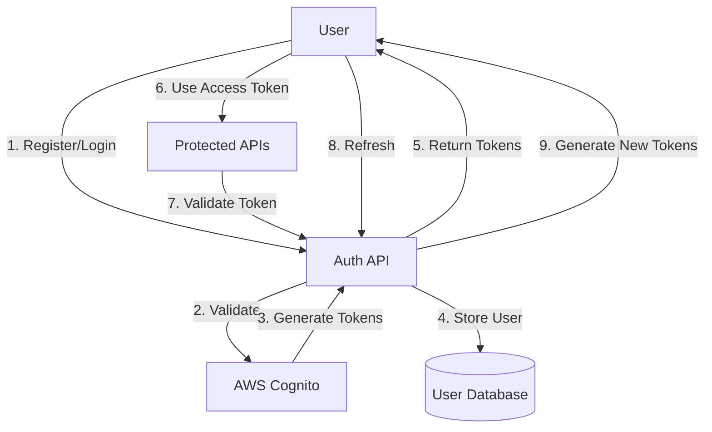

Key Components:
- User registration and login flows
- Social login integration (Google, Facebook, Apple)
- JWT token generation and validation
- Refresh token rotation
- Email verification
- Password reset functionality
- Integration with AWS Cognito for identity management

### 2. Profile Management Service

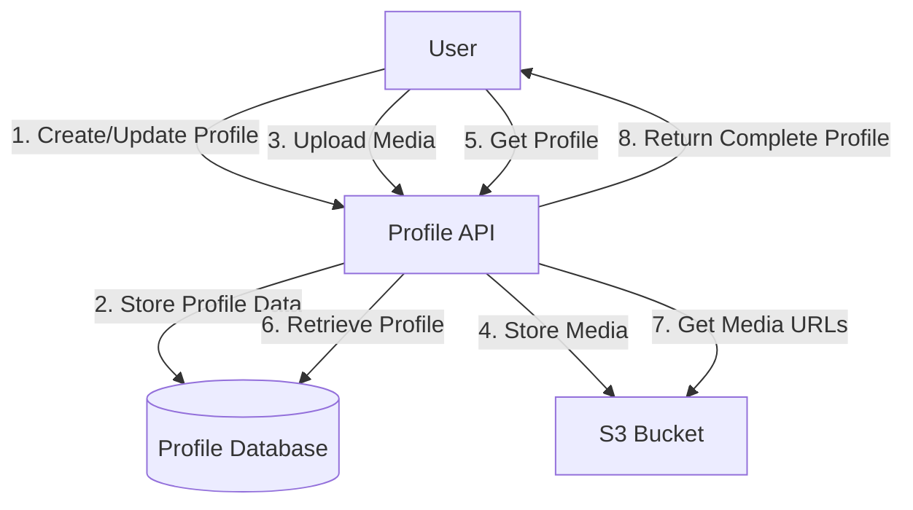

Key Components:
- Profile CRUD operations
- Media upload and management
- Profile completion tracking
- Privacy settings management
- Profile verification status
- Profile search capabilities (for premium users)

### 3. Questionnaire Engine

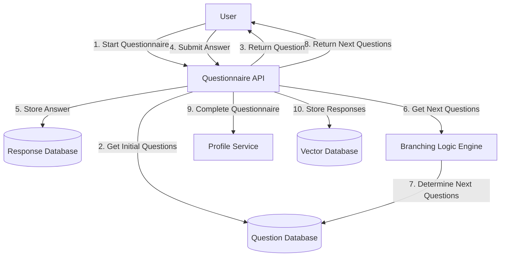

Key Components:
- Question bank management
- Dynamic branching logic implementation
- Progress tracking
- Adaptive questioning based on previous answers
- Response storage and analysis
- Question block/module organization
- Question importance weighting

### 4. AI Matching Service

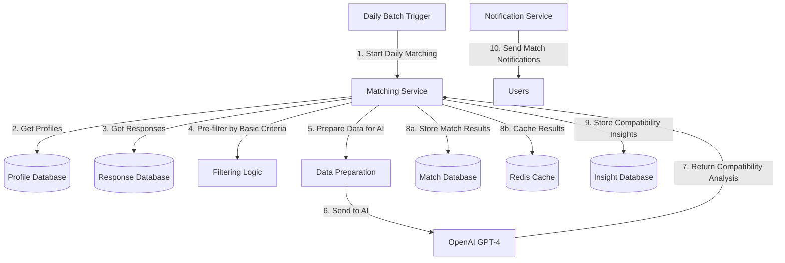

Key Components:
- Daily batch processing of matches
- AI integration for compatibility analysis
- Vector embedding-based similarity matching
- Compatibility score calculation
- Match insight generation
- Caching of match results
- Differentiated matching for free vs. premium users

### 5. Messaging Service

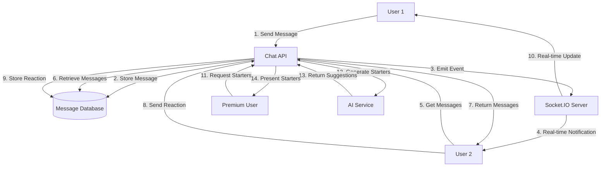

Key Components:
- Real-time messaging using WebSockets
- Message history storage and retrieval
- Message read status tracking
- Media (photo) sharing
- Message reactions/emoji responses
- AI-generated conversation starters (premium feature)
- Message retention policy implementation

### 6. Notification Service

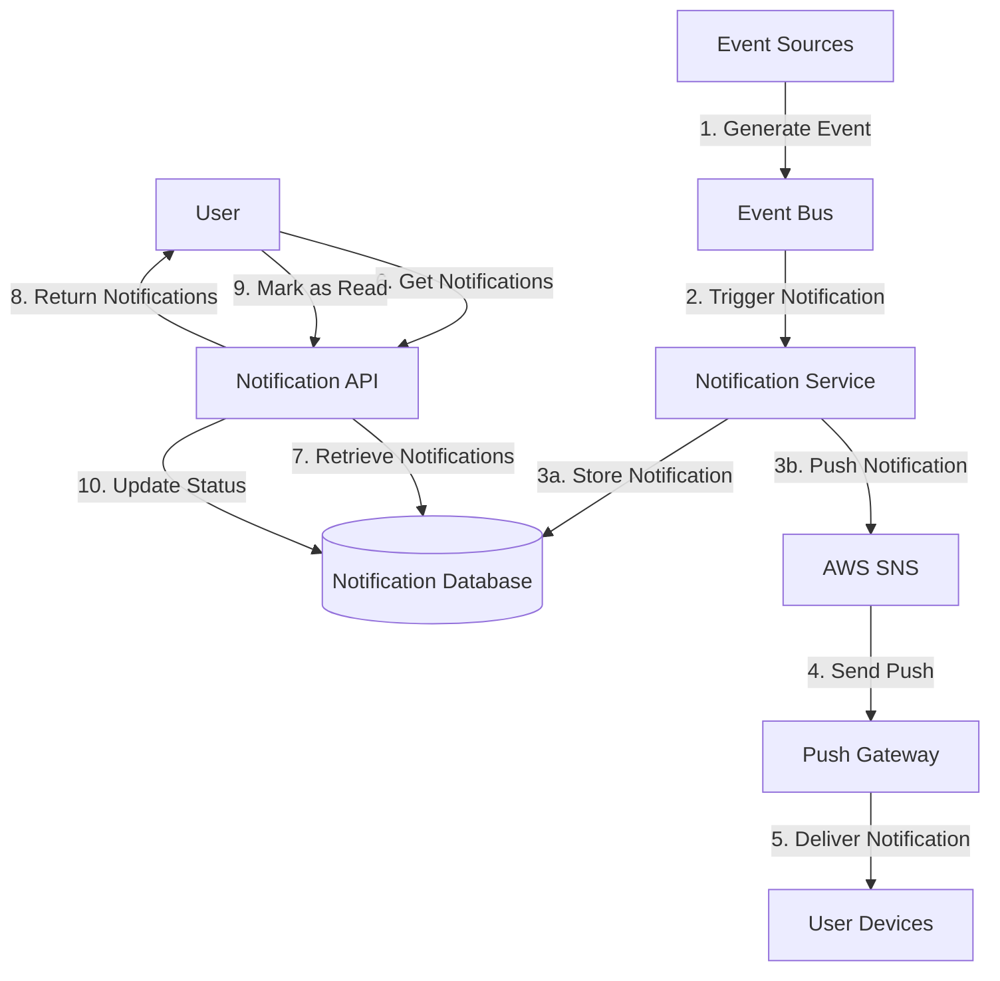

Key Components:
- Event-driven notification generation
- Push notification delivery
- In-app notification center
- Notification preferences management
- Notification status tracking (read/unread)
- Batch notification processing

### 7. Subscription Management

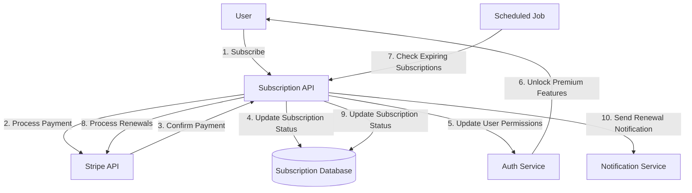

Key Components:
- Subscription plan management
- Payment processing integration (Stripe)
- Feature access control based on subscription tier
- Subscription analytics
- Renewal and cancellation handling
- Subscription-related notifications

## Data Flows

### User Registration & Profile Creation

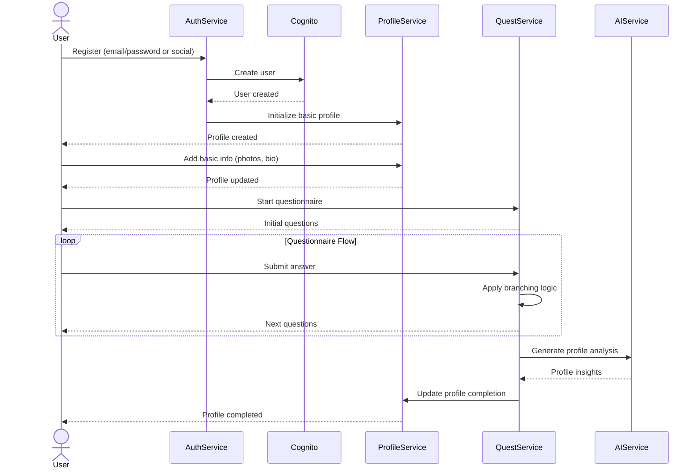

### Match Generation Process

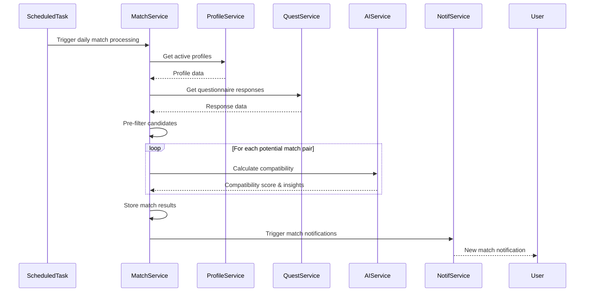

### Messaging Flow

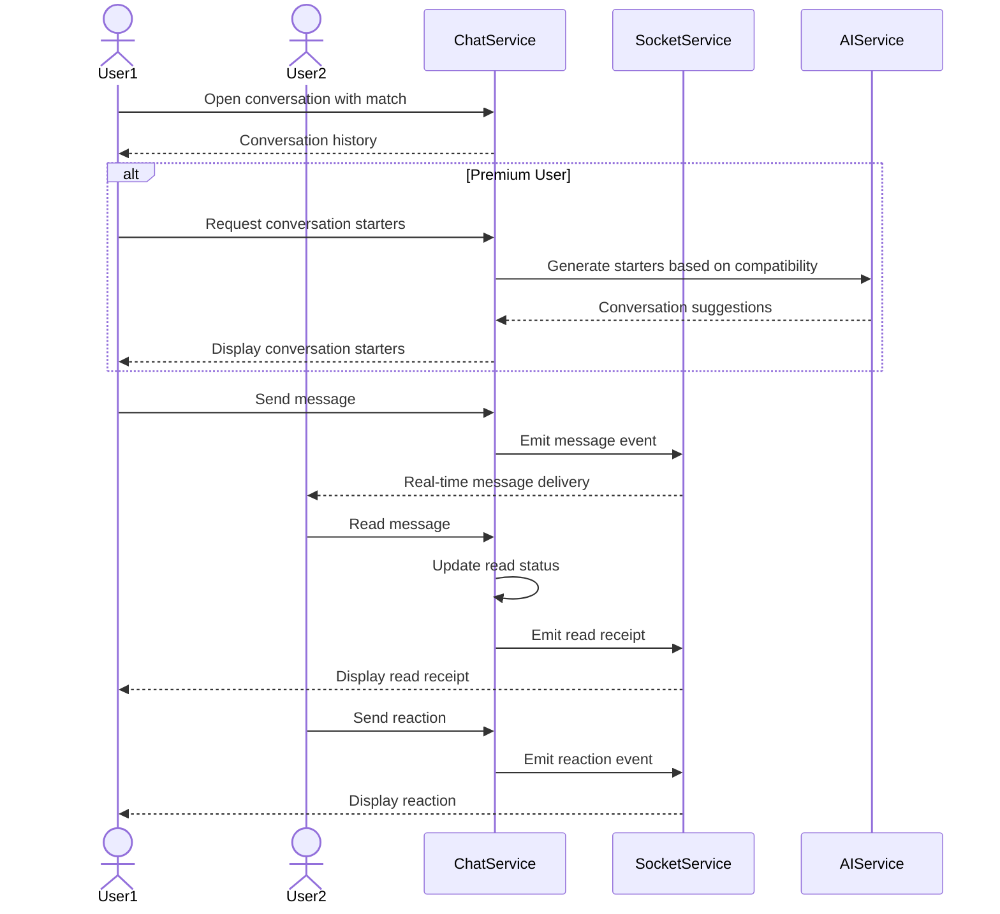

## Infrastructure Architecture

The infrastructure is based on AWS services, implemented using infrastructure as code with AWS CDK.

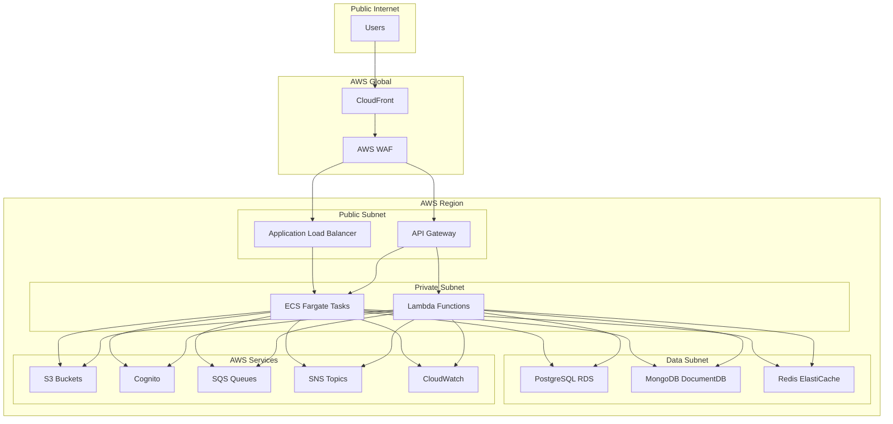

### Key Infrastructure Components:

1. **Networking**:
   - VPC with public and private subnets across multiple availability zones
   - NAT Gateways for outbound traffic from private subnets
   - Security Groups for service-level network access control

2. **Compute**:
   - ECS Fargate for containerized microservices
   - Lambda for event-driven processing and scheduled tasks

3. **Data Storage**:
   - Multi-AZ RDS for PostgreSQL (primary relational data)
   - DocumentDB cluster for MongoDB (flexible schema data)
   - ElastiCache Redis cluster for caching and session management
   - S3 buckets for media storage and static assets

4. **API Management**:
   - API Gateway for RESTful API endpoints
   - Application Load Balancer for service routing

5. **Security**:
   - WAF for application-layer protection
   - Security Groups for service-level access control
   - IAM Roles for service permissions
   - Cognito for user authentication
   - KMS for encryption

6. **Monitoring & Operations**:
   - CloudWatch for logs and metrics
   - X-Ray for distributed tracing
   - CloudWatch Alarms for alerting
   - CloudWatch Dashboards for operational visibility

## Deployment Strategy

The application follows a CI/CD approach with AWS CodePipeline:

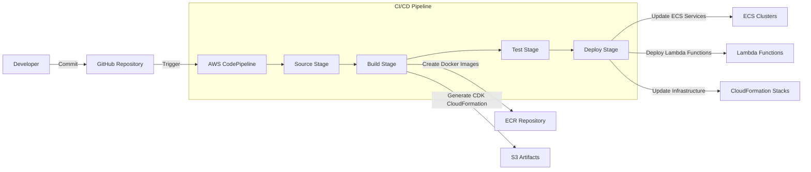

### Deployment Stages:

1. **Development**:
   - Local development with Docker Compose
   - Development environment for feature testing

2. **Staging**:
   - Fully automated deployment
   - Integration testing
   - Performance testing
   - Security testing

3. **Production**:
   - Blue/Green deployment strategy
   - Automated rollback capability
   - Canary releases for critical components

## Scalability Considerations

- **Horizontal Scaling**:
  - ECS services can scale based on CPU/Memory utilization
  - DynamoDB on-demand capacity for unpredictable workloads
  - Auto-scaling for RDS read replicas

- **Caching Strategy**:
  - ElastiCache Redis for frequently accessed data
  - CloudFront for static content
  - API response caching

- **Database Optimization**:
  - Read replicas for read-heavy operations
  - Connection pooling
  - Index optimization
  - Query performance monitoring

- **Batch Processing**:
  - Daily match processing using Lambda
  - SQS queues for asynchronous task handling
  - Retry mechanisms for failed operations

## Security Architecture

- **Authentication & Authorization**:
  - Cognito for identity management
  - JWT for API authorization
  - Fine-grained permissions based on subscription tier

- **Data Protection**:
  - Encryption at rest for all databases
  - Encryption in transit (TLS)
  - Secure API communication

- **Network Security**:
  - VPC with private subnets for data services
  - Security Groups for granular access control
  - WAF for application-layer protection

- **Compliance**:
  - Logging of all administrative actions
  - Audit trails for sensitive operations
  - Regular security scanning

## Development Approach

- **Code Quality**:
  - TypeScript for type safety
  - ESLint for code quality
  - Prettier for consistent formatting
  - Unit and integration testing requirements

- **Development Environment**:
  - Containerized development with Docker
  - Local environment setup with docker-compose
  - Environment parity across development, staging, and production

- **Documentation**:
  - OpenAPI/Swagger for API documentation
  - README files for each microservice
  - Architecture decision records (ADRs)
  - Infrastructure documentation via AWS CDK

## Technical Debt Management

- Prioritize technical debt alongside feature development
- Regular refactoring sprints
- Code quality metrics tracking
- Architecture reviews
