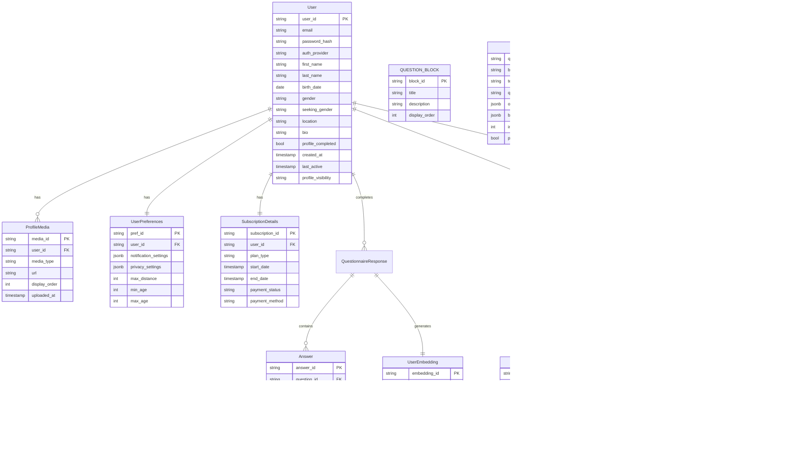

# Perfect Match: Data Model

This document defines the database schema and entity relationships for the Perfect Match application. It serves as the reference for data structures, relationships, and storage patterns.

```yaml
# DATA_MODEL_CONTEXT
primary_database: "PostgreSQL (RDS)"
document_database: "MongoDB (DocumentDB)"
caching_layer: "Redis (ElastiCache)"
object_storage: "S3"
vector_storage: "MongoDB with vector search"
```

## Database Architecture Overview

The Perfect Match application uses a hybrid database approach:

1. **PostgreSQL (RDS)**: For structured, relational data that requires strong consistency, transactions, and complex queries
2. **MongoDB (DocumentDB)**: For flexible schema data like questionnaire responses and AI-generated insights
3. **Redis (ElastiCache)**: For caching, session management, and temporary data storage
4. **S3**: For media storage (profile photos, message attachments)
5. **MongoDB with Vector Search**: For storing and querying vector embeddings


## Entity Relationship Diagram

The following diagram illustrates the core entity relationships in the PostgreSQL database:



## PostgreSQL Schema Details

### User Management Schema

#### User Table
```sql
CREATE TABLE users (
    user_id UUID PRIMARY KEY DEFAULT uuid_generate_v4(),
    email VARCHAR(255) UNIQUE NOT NULL,
    password_hash VARCHAR(255),
    auth_provider VARCHAR(50),
    first_name VARCHAR(100),
    last_name VARCHAR(100),
    birth_date DATE,
    gender VARCHAR(50),
    seeking_gender VARCHAR(50),
    location VARCHAR(255),
    bio TEXT,
    profile_completed BOOLEAN DEFAULT FALSE,
    created_at TIMESTAMP WITH TIME ZONE DEFAULT NOW(),
    last_active TIMESTAMP WITH TIME ZONE DEFAULT NOW(),
    profile_visibility VARCHAR(50) DEFAULT 'matches_only'
);

CREATE INDEX idx_users_email ON users(email);
CREATE INDEX idx_users_location ON users(location);
CREATE INDEX idx_users_gender_seeking ON users(gender, seeking_gender);
CREATE INDEX idx_users_profile_visibility ON users(profile_visibility);
```

#### Profile Media Table
```sql
CREATE TABLE profile_media (
    media_id UUID PRIMARY KEY DEFAULT uuid_generate_v4(),
    user_id UUID NOT NULL REFERENCES users(user_id) ON DELETE CASCADE,
    media_type VARCHAR(50) NOT NULL,
    url VARCHAR(255) NOT NULL,
    display_order INT NOT NULL,
    uploaded_at TIMESTAMP WITH TIME ZONE DEFAULT NOW(),
    
    CONSTRAINT unique_user_display_order UNIQUE (user_id, display_order)
);

CREATE INDEX idx_profile_media_user_id ON profile_media(user_id);
```

#### User Preferences Table
```sql
CREATE TABLE user_preferences (
    pref_id UUID PRIMARY KEY DEFAULT uuid_generate_v4(),
    user_id UUID NOT NULL REFERENCES users(user_id) ON DELETE CASCADE,
    notification_settings JSONB NOT NULL DEFAULT '{}',
    privacy_settings JSONB NOT NULL DEFAULT '{}',
    max_distance INT,
    min_age INT,
    max_age INT,
    
    CONSTRAINT unique_user_preferences UNIQUE (user_id)
);

CREATE INDEX idx_user_preferences_user_id ON user_preferences(user_id);
```

#### Subscription Details Table
```sql
CREATE TABLE subscription_details (
    subscription_id UUID PRIMARY KEY DEFAULT uuid_generate_v4(),
    user_id UUID NOT NULL REFERENCES users(user_id) ON DELETE CASCADE,
    plan_type VARCHAR(50) NOT NULL,
    start_date TIMESTAMP WITH TIME ZONE NOT NULL,
    end_date TIMESTAMP WITH TIME ZONE,
    payment_status VARCHAR(50) NOT NULL,
    payment_method VARCHAR(50),
    
    CONSTRAINT unique_user_subscription UNIQUE (user_id)
);

CREATE INDEX idx_subscription_user_id ON subscription_details(user_id);
CREATE INDEX idx_subscription_end_date ON subscription_details(end_date);
CREATE INDEX idx_subscription_plan_type ON subscription_details(plan_type);
```

### Questionnaire Schema

#### Question Block Table
```sql
CREATE TABLE question_blocks (
    block_id UUID PRIMARY KEY DEFAULT uuid_generate_v4(),
    title VARCHAR(255) NOT NULL,
    description TEXT,
    display_order INT NOT NULL,
    
    CONSTRAINT unique_block_order UNIQUE (display_order)
);
```

#### Question Table
```sql
CREATE TABLE questions (
    question_id UUID PRIMARY KEY DEFAULT uuid_generate_v4(),
    block_id UUID NOT NULL REFERENCES question_blocks(block_id) ON DELETE CASCADE,
    text TEXT NOT NULL,
    question_type VARCHAR(50) NOT NULL,
    options JSONB,
    branching_logic JSONB,
    importance_weight INT NOT NULL DEFAULT 1,
    premium_only BOOLEAN DEFAULT FALSE,
    
    CONSTRAINT valid_question_type CHECK (question_type IN ('multiple_choice', 'slider', 'open_ended', 'boolean', 'multiple_select'))
);

CREATE INDEX idx_questions_block_id ON questions(block_id);
CREATE INDEX idx_questions_premium ON questions(premium_only);
```

### Matching Schema

#### Match Table
```sql
CREATE TABLE matches (
    match_id UUID PRIMARY KEY DEFAULT uuid_generate_v4(),
    user_id_1 UUID NOT NULL REFERENCES users(user_id) ON DELETE CASCADE,
    user_id_2 UUID NOT NULL REFERENCES users(user_id) ON DELETE CASCADE,
    compatibility_score FLOAT NOT NULL,
    status VARCHAR(50) NOT NULL DEFAULT 'pending',
    created_at TIMESTAMP WITH TIME ZONE DEFAULT NOW(),
    user_1_liked BOOLEAN DEFAULT FALSE,
    user_2_liked BOOLEAN DEFAULT FALSE,
    
    CONSTRAINT unique_user_pair UNIQUE (user_id_1, user_id_2),
    CONSTRAINT different_users CHECK (user_id_1 <> user_id_2),
    CONSTRAINT valid_match_status CHECK (status IN ('pending', 'active', 'rejected', 'expired'))
);

CREATE INDEX idx_matches_user_id_1 ON matches(user_id_1);
CREATE INDEX idx_matches_user_id_2 ON matches(user_id_2);
CREATE INDEX idx_matches_score ON matches(compatibility_score DESC);
CREATE INDEX idx_matches_status ON matches(status);
CREATE INDEX idx_matches_created_at ON matches(created_at);
```

#### Compatibility Insight Table
```sql
CREATE TABLE compatibility_insights (
    insight_id UUID PRIMARY KEY DEFAULT uuid_generate_v4(),
    match_id UUID NOT NULL REFERENCES matches(match_id) ON DELETE CASCADE,
    highlights JSONB NOT NULL,
    detailed_analysis TEXT,
    is_premium BOOLEAN DEFAULT FALSE,
    
    CONSTRAINT unique_match_insight UNIQUE (match_id)
);

CREATE INDEX idx_insights_match_id ON compatibility_insights(match_id);
```

#### Match Attribute Table
```sql
CREATE TABLE match_attributes (
    attribute_id UUID PRIMARY KEY DEFAULT uuid_generate_v4(),
    match_id UUID NOT NULL REFERENCES matches(match_id) ON DELETE CASCADE,
    attribute_name VARCHAR(100) NOT NULL,
    score FLOAT NOT NULL,
    description TEXT,
    
    CONSTRAINT unique_match_attribute UNIQUE (match_id, attribute_name)
);

CREATE INDEX idx_match_attributes_match_id ON match_attributes(match_id);
```

### Messaging Schema

#### Conversation Table
```sql
CREATE TABLE conversations (
    conversation_id UUID PRIMARY KEY DEFAULT uuid_generate_v4(),
    match_id UUID NOT NULL REFERENCES matches(match_id) ON DELETE CASCADE,
    created_at TIMESTAMP WITH TIME ZONE DEFAULT NOW(),
    last_message_at TIMESTAMP WITH TIME ZONE DEFAULT NOW(),
    
    CONSTRAINT unique_match_conversation UNIQUE (match_id)
);

CREATE INDEX idx_conversations_match_id ON conversations(match_id);
CREATE INDEX idx_conversations_last_message ON conversations(last_message_at DESC);
```

#### Message Table
```sql
CREATE TABLE messages (
    message_id UUID PRIMARY KEY DEFAULT uuid_generate_v4(),
    conversation_id UUID NOT NULL REFERENCES conversations(conversation_id) ON DELETE CASCADE,
    sender_id UUID NOT NULL REFERENCES users(user_id) ON DELETE CASCADE,
    message_type VARCHAR(50) NOT NULL DEFAULT 'text',
    content TEXT,
    media_url VARCHAR(255),
    sent_at TIMESTAMP WITH TIME ZONE DEFAULT NOW(),
    read_at TIMESTAMP WITH TIME ZONE,
    
    CONSTRAINT valid_message_type CHECK (message_type IN ('text', 'image', 'reaction'))
);

CREATE INDEX idx_messages_conversation_id ON messages(conversation_id);
CREATE INDEX idx_messages_sender_id ON messages(sender_id);
CREATE INDEX idx_messages_sent_at ON messages(sent_at DESC);
CREATE INDEX idx_messages_read_status ON messages(read_at) WHERE read_at IS NULL;
```

#### Notification Table
```sql
CREATE TABLE notifications (
    notification_id UUID PRIMARY KEY DEFAULT uuid_generate_v4(),
    user_id UUID NOT NULL REFERENCES users(user_id) ON DELETE CASCADE,
    type VARCHAR(50) NOT NULL,
    content JSONB NOT NULL,
    is_read BOOLEAN DEFAULT FALSE,
    created_at TIMESTAMP WITH TIME ZONE DEFAULT NOW()
);

CREATE INDEX idx_notifications_user_id ON notifications(user_id);
CREATE INDEX idx_notifications_type ON notifications(type);
CREATE INDEX idx_notifications_created_at ON notifications(created_at DESC);
CREATE INDEX idx_notifications_read_status ON notifications(is_read);
```

## MongoDB Schema Details

Since MongoDB is schema-flexible, these are conceptual schemas showing the document structure.

### Questionnaire Response Collection

```json
{
  "_id": "ObjectId",
  "userId": "UUID",
  "completedAt": "ISODate",
  "progress": 100,
  "responses": [
    {
      "questionId": "UUID",
      "blockId": "UUID",
      "response": {
        "value": "mixed type based on question",
        "importanceScore": 8
      },
      "answeredAt": "ISODate"
    }
  ],
  "openEndedResponses": [
    {
      "questionId": "UUID",
      "response": "Text response",
      "importanceScore": 7,
      "answeredAt": "ISODate"
    }
  ],
  "metadata": {
    "startedAt": "ISODate",
    "completionTime": 1200,
    "deviceType": "mobile",
    "version": "1.0"
  }
}
```

### User Embedding Collection

```json
{
  "_id": "ObjectId",
  "userId": "UUID",
  "embedding": {
    "vector": [0.1, 0.2, 0.3, ...],
    "dimensions": 1536
  },
  "generatedAt": "ISODate",
  "model": "OpenAI-text-embedding-ada-002",
  "metadata": {
    "keyTraits": ["extroverted", "adventurous", "creative"],
    "keyValues": ["family", "honesty", "ambition"]
  }
}
```

### Compatibility Insights Collection

```json
{
  "_id": "ObjectId",
  "matchId": "UUID",
  "userId1": "UUID",
  "userId2": "UUID",
  "compatibilityScore": 92.5,
  "generatedAt": "ISODate",
  "insights": {
    "summary": "You both share a deep appreciation for intellectual conversations and outdoor adventures.",
    "keyFactors": [
      {
        "name": "Shared Values",
        "score": 90,
        "description": "You both prioritize honesty, family, and personal growth."
      },
      {
        "name": "Communication Style",
        "score": 85,
        "description": "You both prefer direct communication with a touch of empathy."
      }
    ],
    "detailedAnalysis": "Extended text with in-depth compatibility analysis",
    "premiumInsights": {
      "conversationStarters": [
        "Ask about their recent hiking trip to the mountains.",
        "Discuss the latest book you've both mentioned enjoying."
      ],
      "potentialChallenges": [
        "Different approaches to financial planning may require compromise."
      ]
    }
  },
  "aiModel": "GPT-4",
  "version": "1.0"
}
```

### Message Collection

```json
{
  "_id": "ObjectId",
  "conversationId": "UUID",
  "senderId": "UUID",
  "recipientId": "UUID",
  "messageType": "text",
  "content": "Hello, how are you today?",
  "mediaUrl": null,
  "reactions": [
    {
      "userId": "UUID",
      "reaction": "❤️",
      "createdAt": "ISODate"
    }
  ],
  "sentAt": "ISODate",
  "readAt": null,
  "metadata": {
    "isDeleted": false,
    "clientMessageId": "client-generated-id",
    "appVersion": "1.0"
  }
}
```

## Redis Data Structures

Redis is used for volatile, frequently accessed data with the following key patterns:

### Session Management
```
sessions:{userId} -> { JSON with session data }
```

### Match Caching
```
matches:recent:{userId} -> [Array of recent match IDs]
match:{matchId} -> { JSON with match preview data }
```

### Rate Limiting
```
ratelimit:ai:{serviceType}:{userId} -> { count, resetAt }
```

### Feature Flags
```
feature_flags:{featureId} -> { enabled, config }
```

## Vector Database Schema

The vector database is implemented as a collection in MongoDB with vector search capabilities:

```json
{
  "_id": "ObjectId",
  "userId": "UUID",
  "profileVector": {
    "vector": [0.1, 0.2, ...],
    "metadata": {
      "gender": "female",
      "ageRange": "25-30",
      "location": "New York"
    }
  },
  "personalityTraits": {
    "vector": [0.3, 0.4, ...],
    "metadata": {
      "traits": ["extroverted", "creative", "analytical"]
    }
  },
  "relationshipValues": {
    "vector": [0.5, 0.6, ...],
    "metadata": {
      "values": ["honesty", "independence", "adventure"]
    }
  },
  "createdAt": "ISODate",
  "updatedAt": "ISODate"
}
```

## Data Flow and Access Patterns

### Key Data Access Patterns

1. **Profile Creation Flow**:
   - Write user basic info to PostgreSQL
   - Store profile media in S3
   - Store questionnaire responses in MongoDB
   - Generate and store embeddings in MongoDB

2. **Match Generation Flow**:
   - Read user preferences from PostgreSQL
   - Read questionnaire responses from MongoDB
   - Pre-filter potential matches using vector similarity
   - Generate compatibility scores using AI
   - Write match results to PostgreSQL
   - Write detailed insights to MongoDB
   - Cache recent matches in Redis

3. **Match Discovery Flow**:
   - Read matches from Redis cache (fast path)
   - Fall back to PostgreSQL for complete list
   - Fetch compatibility insights from MongoDB based on subscription tier
   - Lazy-load media from S3

4. **Messaging Flow**:
   - Write messages to MongoDB
   - Update conversation metadata in PostgreSQL
   - Cache conversation previews in Redis
   - Store media attachments in S3

## Data Migration Strategy

### Versioning Approach

1. **PostgreSQL Migrations**:
   - Use sequential migration files
   - Apply migrations in transaction where possible
   - Include both up and down migration paths

2. **MongoDB Schema Evolution**:
   - Version document schemas with schema version field
   - Use application-level schema validation
   - Handle multiple schema versions in application code during transitions

### Migration Process

1. **Planning Phase**:
   - Document schema changes
   - Assess impact on existing data
   - Plan backward compatibility

2. **Implementation Phase**:
   - Create migration scripts
   - Test on copy of production data
   - Schedule maintenance window if needed

3. **Execution Phase**:
   - Execute migrations with monitoring
   - Verify data integrity
   - Update application to use new schema

4. **Verification Phase**:
   - Verify application functionality
   - Perform data validation checks
   - Monitor for performance impacts

## Data Security Considerations

1. **Data at Rest Encryption**:
   - All RDS databases encrypt data at rest
   - DocumentDB encryption enabled
   - S3 bucket encryption enabled

2. **Sensitive Data Handling**:
   - PII encrypted with field-level encryption
   - Credit card information never stored, only tokens

3. **Data Access Control**:
   - Row-level security policies
   - IAM roles with least privilege
   - Audit logging for data access

4. **Data Retention Policies**:
   - Message data: Configurable retention period
   - User data: Retained until account deletion
   - Activity logs: 90 days

## Performance Optimization

1. **Indexing Strategy**:
   - Indexes on frequently queried fields
   - Compound indexes for common query patterns
   - Regularly review and optimize index usage

2. **Query Optimization**:
   - Use explain plan to analyze query performance
   - Optimize slow queries
   - Use appropriate pagination

3. **Caching Strategy**:
   - Cache match results in Redis
   - Cache user profiles and preferences
   - Time-based cache invalidation

4. **Data Partitioning**:
   - Partition large tables by date or region
   - Consider sharding strategy for future scale

## Data Backup and Recovery

1. **Backup Strategy**:
   - Automated daily backups of RDS and DocumentDB
   - Point-in-time recovery enabled
   - S3 versioning enabled

2. **Recovery Process**:
   - Documented recovery procedures
   - Regular recovery testing
   - RTO and RPO defined and measured

3. **Disaster Recovery**:
   - Cross-region replication for critical data
   - Recovery runbooks
   - Regular DR drills
