# Perfect Match: Critical Workflows

This document outlines the key business processes and user journeys within the Perfect Match application. It serves as a reference for understanding how the different components of the system interact to deliver the core functionality.

```yaml
# WORKFLOW_CONTEXT
workflow_type: "User and System Flows"
primary_actors: "Users, AI Matching System, Notification System"
business_criticality: "High"
```

## Core User Journeys

### 1. User Registration and Profile Creation

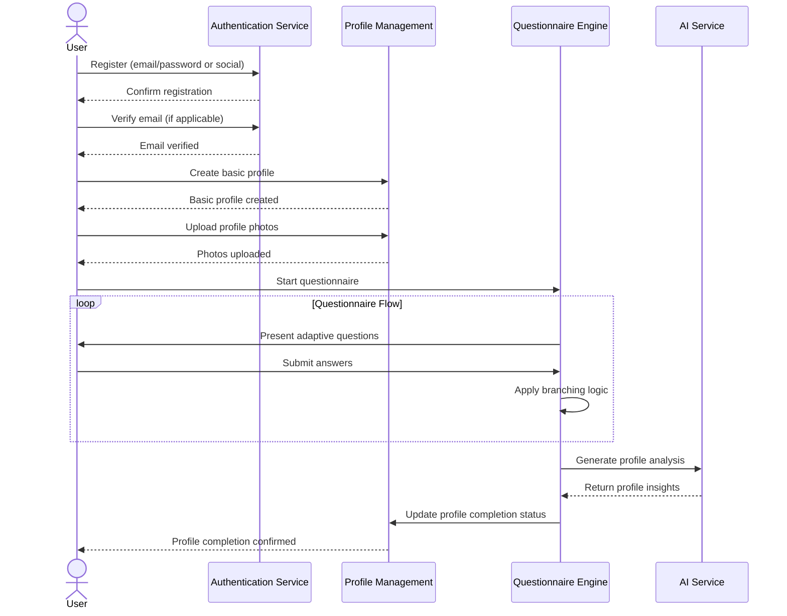

**Critical Steps and Decision Points:**

1. **Registration Method Selection**:
   - Email/password registration requires email verification
   - Social login bypasses email verification but requires provider token

2. **Profile Photo Requirements**:
   - At least one profile photo required
   - Face verification check to ensure quality

3. **Questionnaire Completion**:
   - User must complete minimum required questions (approx. 60% of presented questions)
   - Branching logic adapts based on previous answers
   - Importance weighting affects match calculations

4. **Profile Analysis**:
   - AI service processes all responses
   - Generates profile summary and key traits
   - Creates embedding vectors for future matching

**Error Handling and Edge Cases:**

- If email verification fails, user can request new verification email
- If questionnaire is abandoned mid-way, progress is saved and can be resumed
- If AI service is unavailable, profile completion is queued for later processing

### 2. Daily Match Generation Process

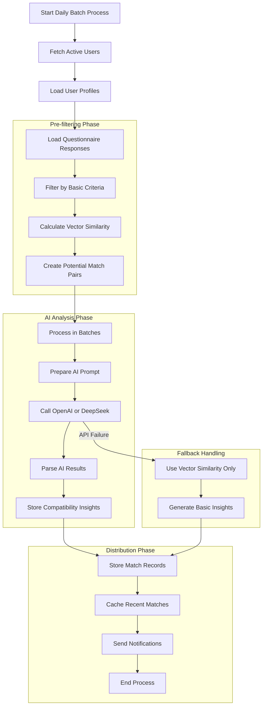

**Critical Steps and Decision Points:**

1. **Scheduling**:
   - Process runs daily at 3:00 AM UTC
   - Considers all users active in the last 30 days

2. **Pre-filtering Criteria**:
   - Location proximity (based on user preferences)
   - Age preferences (mutual compatibility)
   - Gender preferences (mutual compatibility)
   - Relationship goal alignment

3. **Vector Similarity**:
   - Uses embedding vectors generated during profile creation
   - Calculates cosine similarity between vectors
   - Sets minimum threshold of 0.65 for further consideration

4. **AI Processing Considerations**:
   - Batch size of 50 potential matches per API call
   - Timeout of 15 seconds per batch
   - Retry mechanism (3 attempts with exponential backoff)
   - Switch to DeepSeek API if OpenAI failure rate exceeds 10%

5. **Compatibility Score Generation**:
   - Raw score from AI (0-100)
   - Weighted by importance factors from questionnaire
   - Adjustment based on profile completeness (0.8-1.0 factor)

6. **Match Distribution Controls**:
   - Free users: Maximum 10 new matches per day
   - Premium users: Maximum 50 new matches per day
   - Minimum compatibility threshold: 70% for standard delivery

**Error Handling and Edge Cases:**

- If AI services are completely unavailable, fall back to vector similarity scores only
- If user pool is small in a geographic area, expand search radius progressively
- For new users with few matches, artificially boost visibility in the first week

### 3. User Match Discovery and Interaction

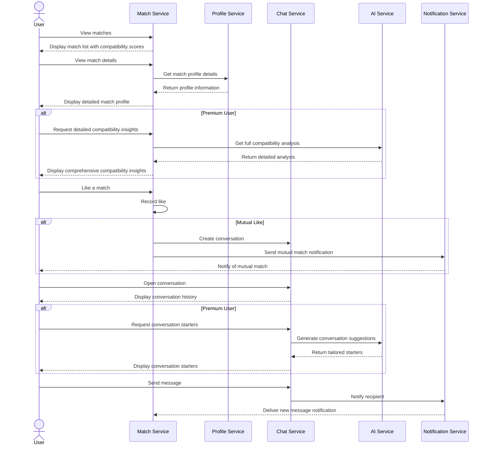

**Critical Steps and Decision Points:**

1. **Match Presentation Strategy**:
   - Sorted by compatibility score (highest first)
   - Daily limit enforced (10 for free, 50 for premium)
   - Premium users: Full match list available
   - Free users: Limited to most recent matches

2. **Compatibility Insight Access**:
   - Free users: Basic summary and top 3 compatibility factors
   - Premium users: Comprehensive analysis, conversation starters, potential challenges

3. **Like Mechanism**:
   - One-sided likes stored but not immediately visible to recipient
   - Premium users can see who liked them
   - Mutual likes automatically enable conversation

4. **Conversation Initiation**:
   - Requires mutual like to enable messaging
   - Free users: Basic text and image messaging
   - Premium users: Access to AI-generated conversation starters

**Error Handling and Edge Cases:**

- If match details cannot be retrieved, show basic information with option to refresh
- If user unmatches or blocks, immediately remove from match lists and disable conversation
- If message delivery fails, retry with exponential backoff and notify sender of delivery status

### 4. Subscription Management Process

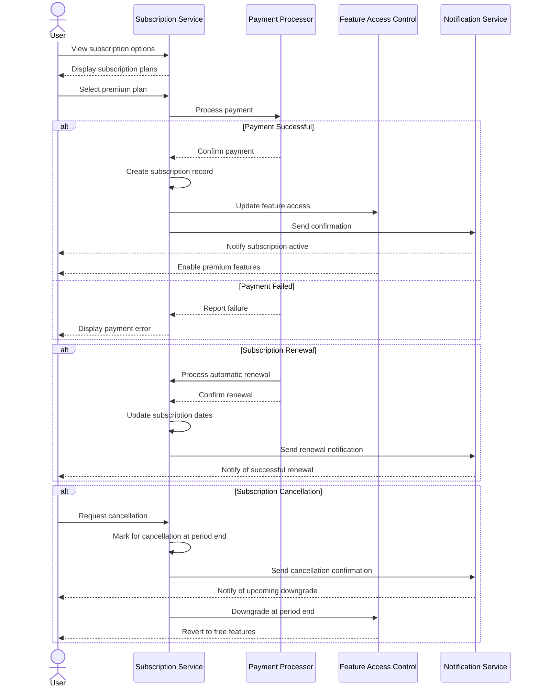

**Critical Steps and Decision Points:**

1. **Plan Selection**:
   - Monthly billing ($19.99/month)
   - Annual billing ($199.99/year, ~17% savings)
   - Free tier (default)

2. **Payment Processing**:
   - Integrate with Stripe for secure payment handling
   - Support major credit/debit cards
   - Support Apple Pay/Google Pay for mobile

3. **Feature Activation**:
   - Immediate access upon successful payment
   - Clear indication of premium features
   - Cached feature access checks for performance

4. **Renewal Handling**:
   - Automatic renewal 24 hours before expiration
   - Email notification 7 days before renewal
   - In-app reminder 3 days before renewal

5. **Cancellation Policy**:
   - Service continues until end of billing period
   - No partial refunds for cancellation
   - Option to rejoin at any time

**Error Handling and Edge Cases:**

- If payment method expires, send notification 7 days before next renewal
- If renewal payment fails, retry 3 times over 5 days before downgrading
- If user resubscribes within 30 days of cancellation, restore previous preference settings

## System Workflows

### 1. AI-Powered Compatibility Analysis Process

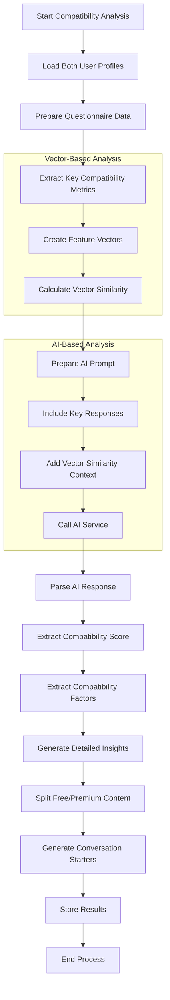

**Critical Steps and Technical Details:**

1. **Data Preparation**:
   - Load structured responses from PostgreSQL
   - Load unstructured responses from MongoDB
   - Combine into unified user profile data

2. **Vector Creation**:
   - Generate embeddings for text responses using OpenAI embedding API
   - Create multi-dimensional feature vectors for core compatibility dimensions:
     - Values (family, career, lifestyle)
     - Communication style
     - Relationship expectations
     - Personality traits

3. **Initial Similarity Calculation**:
   - Cosine similarity between corresponding vectors
   - Weighted according to user importance ratings

4. **AI Prompt Engineering**:
   - System prompt defining compatibility analysis task
   - Include key questionnaire responses from both users
   - Include vector similarity scores as context
   - Request structured output format (JSON)

5. **Response Parsing**:
   - Extract numerical compatibility score (0-100)
   - Extract 5-7 key compatibility factors with individual scores
   - Extract detailed compatibility analysis text
   - Extract potential conversation starters
   - Extract potential relationship challenges

6. **Content Segregation**:
   - Basic content: Overall score, top 3 factors, brief summary
   - Premium content: Full factor list, detailed analysis, conversation starters, challenges

**OpenAI Prompt Example:**

```
System: You are a relationship compatibility analyst. Based on the questionnaire responses of two users, analyze their compatibility and generate insights.

User: I need to analyze the compatibility between User A and User B.

User A questionnaire data:
{USER_A_DATA}

User B questionnaire data:
{USER_B_DATA}

Vector similarity scores:
- Values similarity: 0.82
- Communication style similarity: 0.75
- Relationship expectations similarity: 0.91
- Personality traits similarity: 0.68

Provide a detailed compatibility analysis including:
1. Overall compatibility score (0-100)
2. 5-7 key compatibility factors with individual scores
3. Detailed explanation of compatibility strengths and potential challenges
4. 3-5 conversation starter suggestions based on shared interests or values
5. 2-3 potential relationship challenges that may need attention

Format your response as JSON with the following structure:
{
  "compatibilityScore": number,
  "compatibilityFactors": [
    {"name": string, "score": number, "description": string}
  ],
  "detailedAnalysis": string,
  "conversationStarters": [string],
  "potentialChallenges": [string]
}
```

### 2. Dynamic Questionnaire Branching Logic

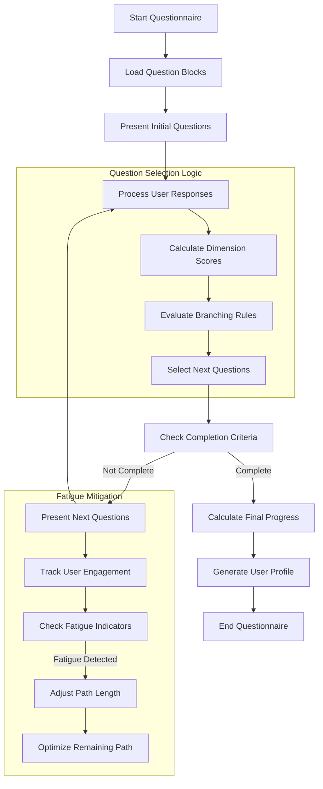

**Critical Steps and Technical Details:**

1. **Question Block Organization**:
   - Questions organized in thematic blocks/modules
   - Each block has entry and exit conditions
   - Initial block focuses on basic demographics and relationship goals

2. **Branching Logic Implementation**:
   - Decision tree model with conditional probabilities
   - Rule-based system evaluating previous answers
   - Importance weights affect path selection
   - JSON-based branching rules stored in database

3. **Dimension Calculation**:
   - Calculate scores for key compatibility dimensions:
     - Relationship Compatibility (RC)
     - Communication Style (CS)
     - Emotional Intelligence (EI)
     - Lifestyle Compatibility (LC)
     - Core Values Alignment (CV)

4. **Path Optimization**:
   - Track question sequence and user inputs
   - Predict most informative questions based on current knowledge
   - Skip redundant or low-value questions based on prior responses

5. **Fatigue Detection and Mitigation**:
   - Monitor response time patterns
   - Track engagement metrics (changed answers, time spent)
   - Adjust remaining question count if fatigue detected
   - Prioritize high-importance questions if shortening path

6. **Completion Criteria**:
   - Minimum 60% of adaptive path completed
   - All critical dimensions have sufficient data points
   - User has provided at least 3 open-ended responses
   - Final engagement score above threshold

**Branching Rule Example:**

```json
{
  "questionId": "q1",
  "text": "What are you looking for right now?",
  "branchingRules": [
    {
      "condition": {
        "answer": "option3", // Serious Relationship
        "importance": ">= 7"
      },
      "nextQuestions": ["q5", "q8", "q12"],
      "skipQuestions": ["q4", "q7"],
      "dimensionAdjustments": {
        "RC": 2.0
      }
    },
    {
      "condition": {
        "answer": "option2", // Casual Dating
        "importance": ">= 5"
      },
      "nextQuestions": ["q4", "q7", "q9"],
      "skipQuestions": ["q5", "q12"],
      "dimensionAdjustments": {
        "RC": 0.5
      }
    },
    {
      "default": true,
      "nextQuestions": ["q3", "q6", "q10"]
    }
  ]
}
```

### 3. Notification Delivery Workflow

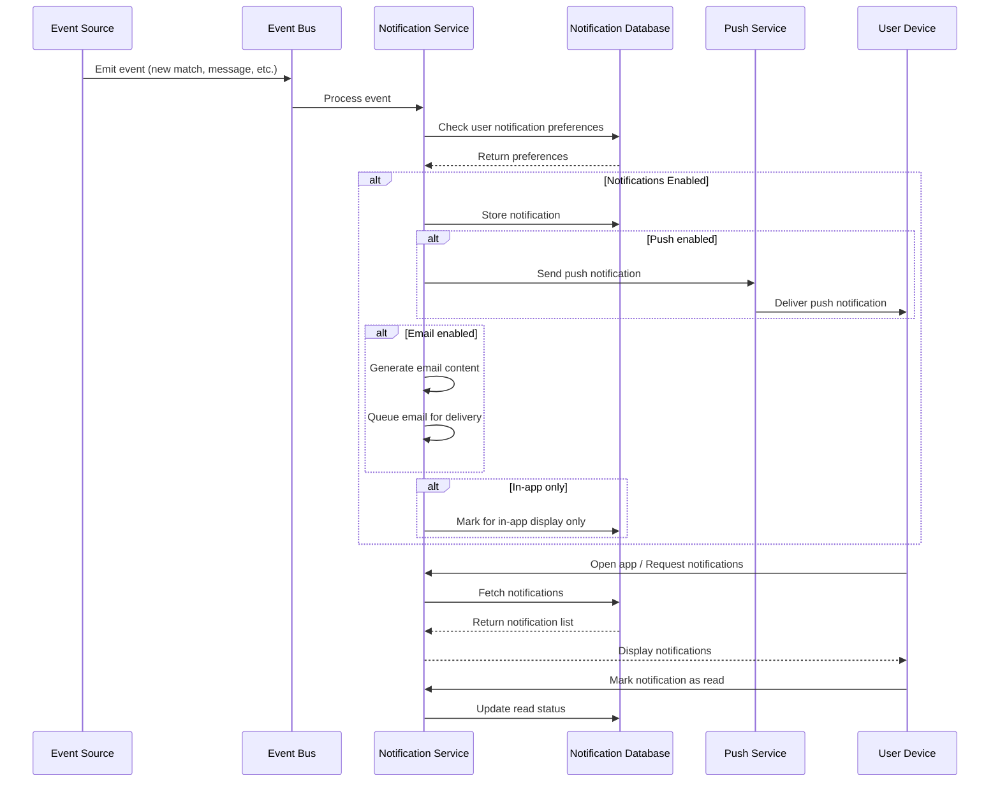

**Critical Steps and Technical Details:**

1. **Event Types and Sources**:
   - New match generation (Match Service)
   - Received message (Chat Service)
   - Profile like (Match Service)
   - Mutual match (Match Service)
   - Subscription events (Subscription Service)

2. **Notification Channels**:
   - Push notifications (Firebase Cloud Messaging)
   - In-app notifications (stored in database)
   - Email notifications (for critical updates)

3. **User Preference Controls**:
   - Granular settings for each notification type
   - Channel preferences (push, in-app, email)
   - Quiet hours settings (time-based delivery)

4. **Delivery Optimization**:
   - Batching of similar notifications
   - Rate limiting (maximum notifications per hour)
   - Priority-based queuing

5. **Storage and Retention**:
   - In-app notifications stored for 30 days
   - Read status tracked for badge counters
   - Archiving option for important notifications

**Notification Schema Example:**

```json
{
  "notificationId": "notif-123",
  "userId": "user-456",
  "type": "new_match",
  "priority": "medium",
  "content": {
    "matchId": "match-789",
    "userId": "matched-user-123",
    "firstName": "Jane",
    "compatibilityScore": 92,
    "profileImage": "https://storage.url/profiles/user-123/1.jpg"
  },
  "channels": {
    "push": true,
    "inApp": true,
    "email": false
  },
  "status": {
    "delivered": true,
    "read": false,
    "interacted": false
  },
  "timestamps": {
    "created": "2025-04-03T12:34:56Z",
    "delivered": "2025-04-03T12:35:01Z",
    "read": null
  }
}
```

## Critical Integration Workflows

### 1. OpenAI API Integration Workflow

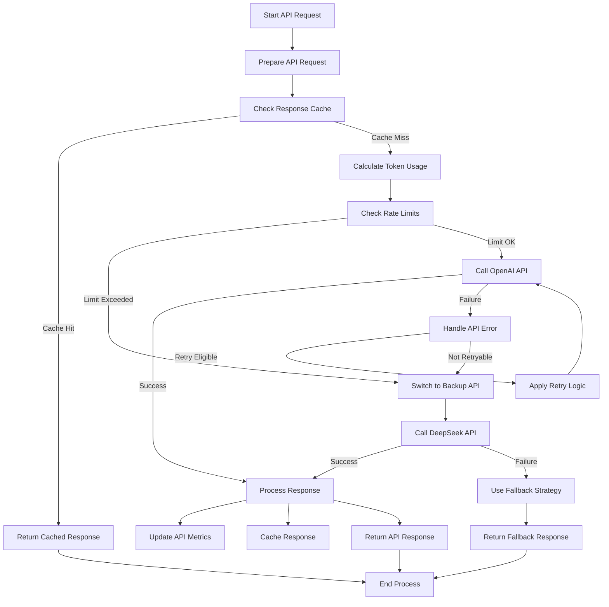

**Critical Steps and Technical Details:**

1. **Request Preparation**:
   - Construct prompt according to function (matching, profile analysis, conversation starters)
   - Apply prompt engineering best practices
   - Set appropriate temperature and other parameters

2. **Caching Strategy**:
   - Key generation based on input hash
   - Cache duration based on request type:
     - Match analysis: 24 hours
     - Profile analysis: 7 days
     - Conversation starters: 12 hours
   - Invalidation triggers for changed data

3. **Token Usage Management**:
   - Track token usage by request type
   - Implement rate limiting based on usage tiers
   - Optimize prompts for token efficiency

4. **Error Handling and Retries**:
   - Exponential backoff for rate limit errors
   - Maximum 3 retry attempts
   - Circuit breaker pattern to prevent cascading failures

5. **Fallback Mechanisms**:
   - DeepSeek API as primary backup
   - Local fallback for critical functions:
     - Vector similarity for matching
     - Template-based conversation starters
     - Pre-generated generic insights

6. **Monitoring and Metrics**:
   - Track success/failure rates
   - Monitor response times
   - Log token usage for cost analysis
   - Alert on error rate thresholds

**Implementation Considerations:**

- Use asynchronous processing for batch operations
- Implement request queuing for high-volume periods
- Maintain separate API keys for different functions
- Apply context length optimizations for larger prompts

### 2. Payment Processing Workflow

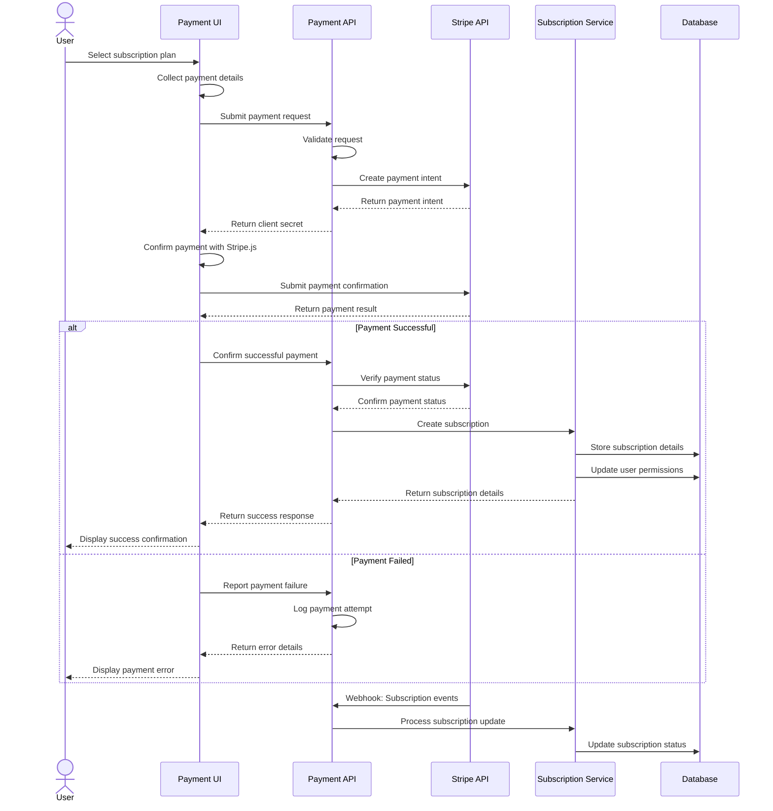

**Critical Steps and Technical Details:**

1. **Plan Selection and Initialization**:
   - Present subscription options (monthly, annual)
   - Calculate price including applicable taxes
   - Create payment intent with proper metadata

2. **Payment Method Handling**:
   - Client-side collection using Stripe Elements
   - Support for credit/debit cards
   - Integration with Apple Pay / Google Pay
   - Strong Customer Authentication (SCA) compliance

3. **Security Considerations**:
   - PCI compliance through Stripe.js
   - No card data touches application servers
   - HTTPS for all payment-related communication
   - Anti-fraud measures (address verification, etc.)

4. **Subscription Creation Process**:
   - Create Stripe Customer record (if new)
   - Link payment method to customer
   - Set up subscription with proper billing cycle
   - Store Stripe subscription ID in database

5. **Webhook Processing**:
   - Handle subscription lifecycle events:
     - `subscription.created`
     - `invoice.paid`
     - `subscription.updated`
     - `subscription.canceled`
     - `payment_method.detached`
   - Implement idempotency to prevent duplicate processing

6. **Error Handling Scenarios**:
   - Card declined scenarios
   - Insufficient funds
   - Expired card
   - Network errors
   - Address verification failures

**Stripe Integration Details:**

- Use latest Stripe API version
- Implement webhook signature verification
- Store minimal payment information (last 4 digits only)
- Use Stripe Tax for automated tax calculation
- Implement Stripe Radar for fraud prevention

## Monitoring and Maintenance Workflows

### 1. System Health Monitoring

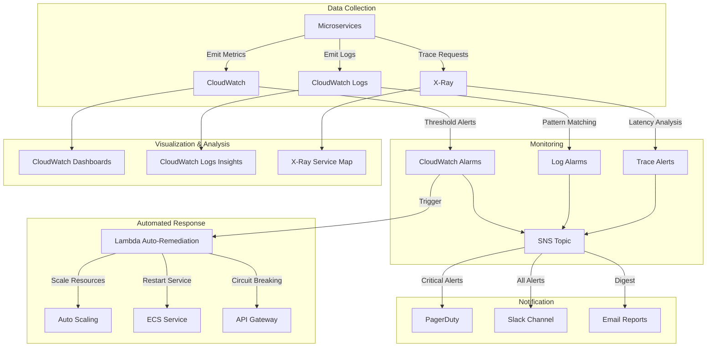

**Critical Steps and Technical Details:**

1. **Key Metrics Monitored**:
   - Service availability (heartbeat checks)
   - API latency (p50, p90, p99 percentiles)
   - Error rates (5xx, 4xx by endpoint)
   - Resource utilization (CPU, memory, connections)
   - Queue depths and processing rates
   - External API integration health
   - Database performance metrics

2. **Log Monitoring Strategy**:
   - Centralized logging with structured format
   - Error pattern detection
   - Anomaly detection on log volume
   - Critical operation success/failure tracking
   - Security event monitoring

3. **Alert Thresholds and Priorities**:
   - P1 (Critical): Service outage, payment failures
   - P2 (High): Degraded performance, elevated error rates
   - P3 (Medium): Warning thresholds crossed, latency increases
   - P4 (Low): Non-critical anomalies, resource utilization warnings

4. **Automated Remediation Actions**:
   - Auto-scaling for resource constraints
   - Service restart for memory leaks
   - Database connection pool reset
   - Cache invalidation
   - Circuit breaking for failing dependencies

5. **Health Check Implementation**:
   - Shallow checks for basic connectivity
   - Deep checks for functional validation
   - Synthetic transactions for end-to-end validation
   - Dependency checks for external services

**Dashboard Organization:**

- Executive dashboard (high-level health)
- Service-specific dashboards (detailed metrics)
- User experience dashboard (client-side metrics)
- Integration health dashboard (external dependencies)
- Cost and usage optimization dashboard

### 2. Database Maintenance and Optimization

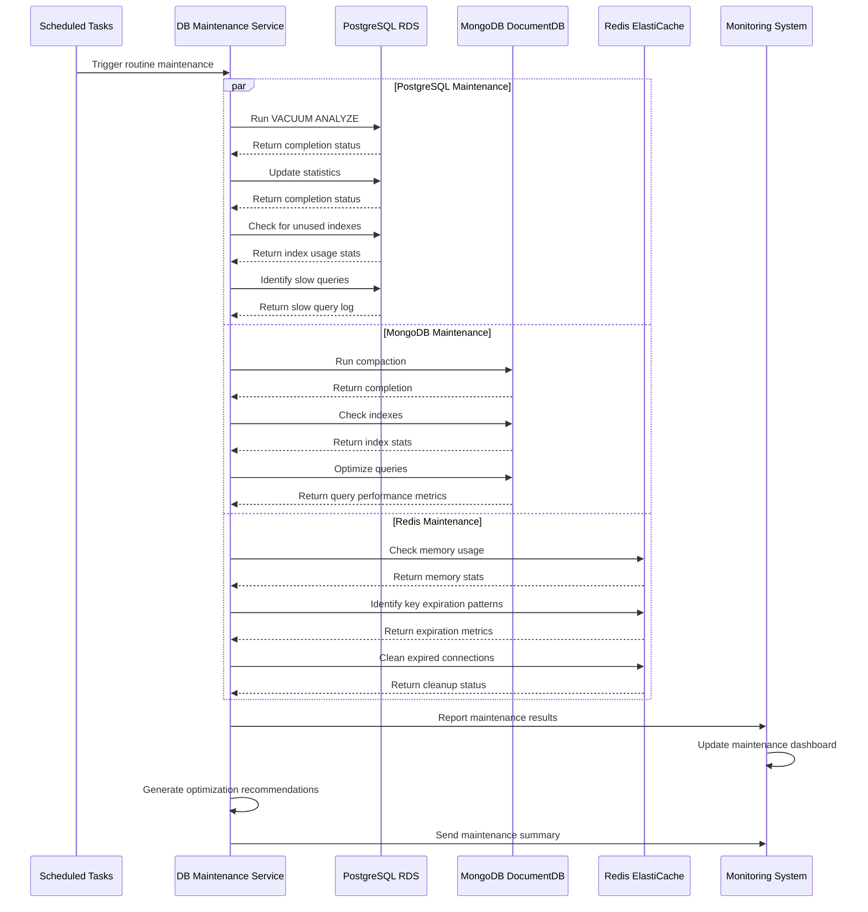

**Critical Steps and Technical Details:**

1. **PostgreSQL Maintenance**:
   - Weekly VACUUM ANALYZE to reclaim space and update statistics
   - Monthly index maintenance to rebuild fragmented indexes
   - Quarterly review of unused indexes
   - Automated execution of stored procedures for maintenance
   - Log rotation and archiving

2. **MongoDB Maintenance**:
   - Weekly compaction to reclaim space
   - Index validation and rebuilding if needed
   - Collection statistics analysis
   - Shard balancing (if deployed in sharded configuration)
   - Oplog size monitoring and adjustment

3. **Redis Maintenance**:
   - Memory usage monitoring
   - Expiration policy review
   - Key space analysis to identify memory consumption patterns
   - Connection pool cleanup
   - Persistence configuration verification

4. **Performance Monitoring**:
   - Slow query logging and analysis
   - Index usage statistics collection
   - Query plan evaluation
   - Resource utilization tracking
   - Connection pooling optimization

5. **Optimization Recommendations**:
   - Automated index suggestions
   - Query rewrite proposals
   - Schema optimization opportunities
   - Caching strategy improvements
   - Resource allocation adjustments

**Implementation Considerations:**

- Run maintenance during off-peak hours
- Implement proper error handling and rollback mechanisms
- Monitor performance impact during maintenance
- Keep historical records of maintenance activities
- Automate routine tasks while keeping manual intervention options

## Business Continuity Workflows

### 1. Backup and Recovery Process

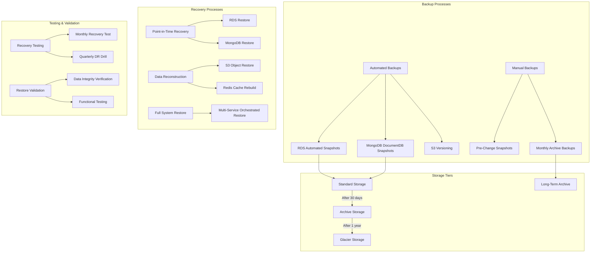

**Critical Steps and Technical Details:**

1. **Backup Schedule**:
   - Automated daily RDS snapshots (35-day retention)
   - Hourly PostgreSQL WAL archiving for point-in-time recovery
   - Daily DocumentDB backups (7-day retention)
   - Continuous S3 versioning with lifecycle policies
   - Weekly full system backups for disaster recovery

2. **Storage Strategy**:
   - Multi-region replication for critical data
   - Tiered storage approach (hot → warm → cold)
   - Encrypted backups using KMS
   - Separate backup access policies
   - Immutable backup preservation for security

3. **Recovery Procedures**:
   - RTO (Recovery Time Objective): 4 hours for critical systems
   - RPO (Recovery Point Objective): 1 hour data loss maximum
   - Documented step-by-step recovery procedures
   - Automated recovery scripts where possible
   - Testing on regular schedule

4. **Validation Process**:
   - Post-recovery integrity verification
   - Data consistency checks
   - Service integration testing
   - Performance validation
   - Security verification

**Recovery Scenarios Covered:**

- Individual data object recovery
- Database point-in-time recovery
- Full service restoration
- Cross-region disaster recovery
- Data corruption remediation

## Security Workflows

### 1. Security Incident Response

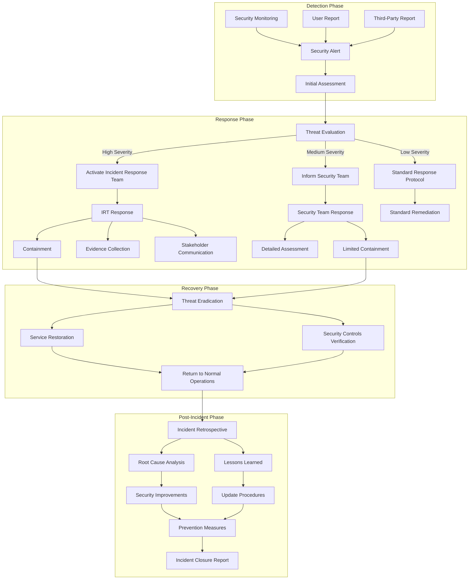

**Critical Steps and Technical Details:**

1. **Detection Mechanisms**:
   - Real-time monitoring with SIEM system
   - Anomaly detection on authentication systems
   - API abuse detection
   - Data access pattern monitoring
   - Vulnerability scanning

2. **Incident Classification**:
   - Severity levels based on impact, scope, and data sensitivity
   - Type classification (data breach, service interruption, unauthorized access)
   - Response team composition based on classification
   - Notification requirements by incident type

3. **Containment Strategies**:
   - API rate limiting or API gateway restrictions
   - User account suspension or forced password reset
   - Network traffic filtering
   - Database read-only mode
   - Service isolation

4. **Evidence Collection**:
   - System logs preservation
   - Database audit logs
   - Network traffic logs
   - User access records
   - Snapshot of affected systems

5. **Communication Plan**:
   - Internal stakeholder notification protocol
   - User notification requirements
   - Regulatory reporting requirements
   - PR and external communication

6. **Recovery Procedures**:
   - System restoration from verified backups
   - Enhanced monitoring post-incident
   - Verification of security controls
   - Confirmation of data integrity

**Incident Response Team (IRT):**

- Security lead
- System administrator
- Database administrator
- Legal representative
- Executive management representative
- External security consultant (if needed)

## User Support Workflows

### 1. User Support and Issue Resolution

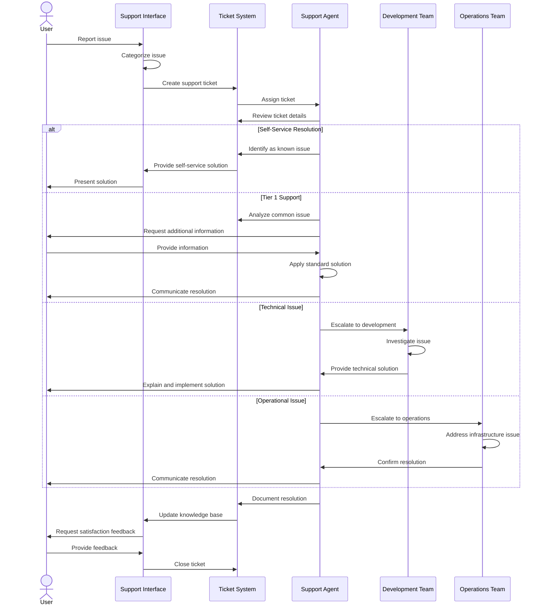

**Critical Steps and Technical Details:**

1. **Issue Categorization**:
   - Account issues (login, profile, settings)
   - Matching system issues (no matches, inappropriate matches)
   - Subscription and payment problems
   - App functionality problems (errors, crashes)
   - Feature requests or enhancement suggestions
   - Privacy and security concerns

2. **Support Channels**:
   - In-app support messaging
   - Email support
   - Help center and knowledge base
   - Community forums (moderated)
   - Social media monitoring

3. **Prioritization Framework**:
   - P1: Critical (payment failures, security issues, data loss)
   - P2: High (major functionality blocked, subscription problems)
   - P3: Medium (non-critical feature issues, UI problems)
   - P4: Low (enhancement requests, minor inconveniences)

4. **Resolution Timeframes**:
   - P1: 4 hours
   - P2: 24 hours
   - P3: 3 business days
   - P4: 7 business days or product roadmap

5. **Escalation Paths**:
   - Level 1: Frontline support (common issues, account management)
   - Level 2: Technical support (advanced troubleshooting)
   - Level 3: Development team (bugfixes, technical issues)
   - Level 4: Management escalation (special circumstances)

6. **Knowledge Management**:
   - Structured issue resolution documentation
   - Solution templates for common problems
   - Regular knowledge base updates
   - Support metrics and trending issues reports

**Support Analytics:**

- First response time
- Time to resolution
- Customer satisfaction score
- Self-service resolution rate
- Escalation frequency
- Recurring issue identification
