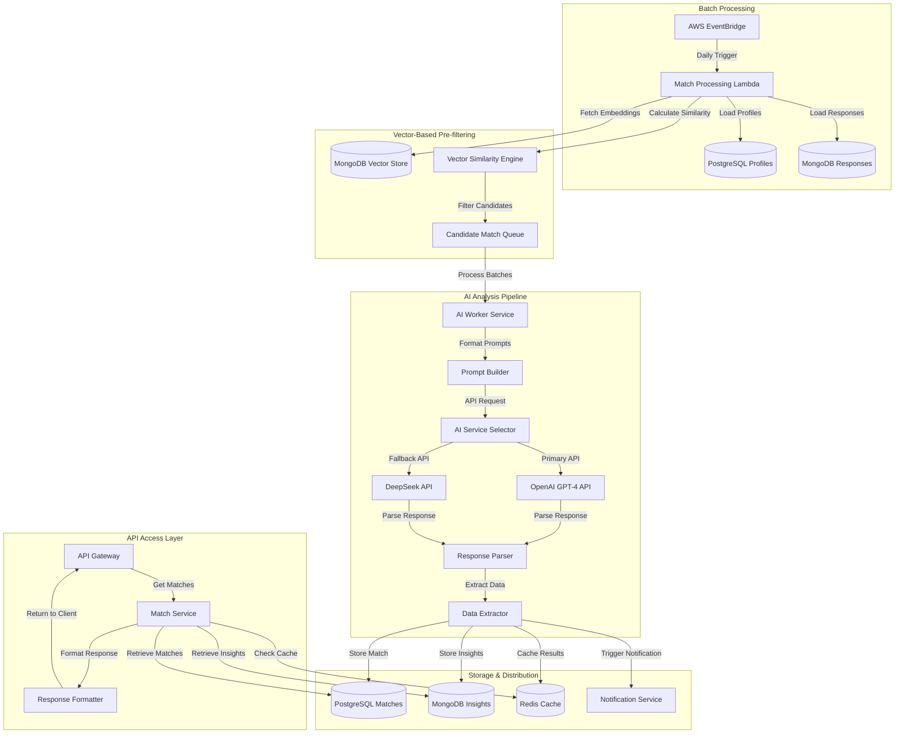

# AI Matching Service

## Service Overview

The AI Matching Service is the core intelligence layer of Perfect Match, responsible for analyzing user profiles, generating compatibility scores, and producing match insights. It leverages advanced AI models to identify compatible matches based on questionnaire responses and user preferences.

```yaml
# SERVICE_CONTEXT
service_name: "ai-matching-service"
service_type: "Core Intelligence"
criticality: "Critical"
dependencies:
  - "OpenAI GPT-4 API"
  - "DeepSeek API (Fallback)"
  - "MongoDB DocumentDB"
  - "PostgreSQL Database"
  - "Redis Cache"
```

## Functional Requirements

### Core Functionality

- Daily batch processing of potential matches
- Vector similarity pre-filtering using embeddings
- AI-powered compatibility analysis using OpenAI GPT-4
- Fallback mechanisms for AI service unavailability
- Compatibility score generation with importance weighting
- Detailed compatibility insight creation
- Differentiated content for free vs. premium users
- Match result caching and optimization
- Matching notification triggers

### API Endpoints

| Endpoint | Method | Description | Auth Required | 
|----------|--------|-------------|--------------|
| `/v1/match/process` | POST | Trigger match processing (admin or scheduled) | Yes (Admin) |
| `/v1/match/analyze` | POST | Generate compatibility analysis for a specific pair | Yes |
| `/v1/match/matches` | GET | Get user's matches with basic insights | Yes |
| `/v1/match/matches/{matchId}` | GET | Get detailed match information | Yes |
| `/v1/match/matches/{matchId}/compatibility` | GET | Get full compatibility insights (premium) | Yes |
| `/v1/match/matches/{matchId}/like` | PUT | Like/unlike a match | Yes |
| `/v1/match/search` | GET | Search matches by criteria (premium) | Yes |

## Technical Design

### Architecture



### Match Generation Process

The match generation process follows these steps:

1. **Batch Initialization**:
   - Scheduled daily processing trigger
   - Load active users from PostgreSQL
   - Apply initial filtering based on basic criteria (location, age preferences, etc.)

2. **Vector-Based Pre-filtering**:
   - Retrieve vector embeddings for users
   - Calculate cosine similarity between embeddings
   - Select candidates above similarity threshold (0.65)
   - Create candidate pairs for AI analysis

3. **AI Compatibility Analysis**:
   - Process candidate pairs in batches
   - Prepare structured prompts with key profile information
   - Submit to OpenAI GPT-4 API (or DeepSeek fallback)
   - Parse AI responses into structured data

4. **Result Processing**:
   - Calculate final compatibility scores with weighting
   - Generate compatibility insights (general and premium)
   - Store match results in PostgreSQL
   - Store detailed insights in MongoDB
   - Cache recent matches in Redis
   - Trigger notifications for new matches

5. **Distribution Control**:
   - Enforce match limits based on subscription tier
   - Free users: Maximum 10 new matches per day
   - Premium users: Maximum 50 new matches per day

### Data Model

#### Match Table (PostgreSQL)
```sql
CREATE TABLE matches (
    match_id UUID PRIMARY KEY DEFAULT uuid_generate_v4(),
    user_id_1 UUID NOT NULL REFERENCES users(user_id) ON DELETE CASCADE,
    user_id_2 UUID NOT NULL REFERENCES users(user_id) ON DELETE CASCADE,
    compatibility_score FLOAT NOT NULL,
    status VARCHAR(50) NOT NULL DEFAULT 'pending',
    created_at TIMESTAMP WITH TIME ZONE DEFAULT NOW(),
    user_1_liked BOOLEAN DEFAULT FALSE,
    user_2_liked BOOLEAN DEFAULT FALSE,
    
    CONSTRAINT unique_user_pair UNIQUE (user_id_1, user_id_2),
    CONSTRAINT different_users CHECK (user_id_1 <> user_id_2),
    CONSTRAINT valid_match_status CHECK (status IN ('pending', 'active', 'rejected', 'expired'))
);

CREATE INDEX idx_matches_user_id_1 ON matches(user_id_1);
CREATE INDEX idx_matches_user_id_2 ON matches(user_id_2);
CREATE INDEX idx_matches_score ON matches(compatibility_score DESC);
CREATE INDEX idx_matches_status ON matches(status);
CREATE INDEX idx_matches_created_at ON matches(created_at);
```

#### Compatibility Insight Schema (MongoDB)
```json
{
  "_id": "ObjectId",
  "matchId": "UUID",
  "userId1": "UUID",
  "userId2": "UUID",
  "compatibilityScore": 92.5,
  "generatedAt": "ISODate()",
  "insights": {
    "summary": "You both share a deep appreciation for intellectual conversations and outdoor adventures.",
    "keyFactors": [
      {
        "name": "Shared Values",
        "score": 90,
        "description": "You both prioritize honesty, family, and personal growth."
      },
      {
        "name": "Communication Style",
        "score": 85,
        "description": "You both prefer direct communication with a touch of empathy."
      },
      {
        "name": "Emotional Intelligence",
        "score": 88,
        "description": "You both demonstrate high self-awareness and empathy for others."
      },
      {
        "name": "Lifestyle Compatibility",
        "score": 75,
        "description": "You share similar daily routines and activity levels."
      },
      {
        "name": "Intellectual Connection",
        "score": 95,
        "description": "You both value deep conversations and continuous learning."
      }
    ],
    "detailedAnalysis": "Extended text with in-depth compatibility analysis...",
    "premiumInsights": {
      "conversationStarters": [
        "Ask about their recent hiking trip to the mountains.",
        "Discuss the latest book you've both mentioned enjoying.",
        "Share your thoughts on the documentary they recommended."
      ],
      "potentialChallenges": [
        "Different approaches to financial planning may require compromise.",
        "Your social energy levels differ somewhat, which may need balancing."
      ],
      "valueAlignmentDetails": "Detailed analysis of value alignment...",
      "communicationPatternAnalysis": "Analysis of communication pattern compatibility..."
    }
  },
  "aiModel": "GPT-4",
  "vectorSimilarityScore": 0.78,
  "matchingVersion": "1.0",
  "metadata": {
    "processingTimeMs": 2340,
    "questionCountUser1": 34,
    "questionCountUser2": 38,
    "dataSources": ["questionnaire", "profile", "activity"]
  }
}
```

#### Match Cache Structure (Redis)
```
# Recent matches by user
recent_matches:{userId} -> [
  {matchId, userId, firstName, age, location, profileImage, 
   compatibilityScore, highlightFactors[], createdAt}
]

# Individual match preview
match_preview:{matchId} -> {
  matchId, userId, firstName, age, location, 
  profileImage, compatibilityScore, highlightFactors[],
  liked, hasLikedYou, conversationId, createdAt
}

# Expiration policies
recent_matches:{userId} -> 24h TTL
match_preview:{matchId} -> 1h TTL
```

### AI Integration

#### OpenAI Prompt Structure

```
System: You are a relationship compatibility analyst for a matchmaking application. Based on the questionnaire responses of two users, analyze their compatibility and generate insights.

User: I need to analyze the compatibility between User A and User B.

User A Profile Summary:
- Age: 32
- Gender: Male
- Location: New York
- Relationship Goal: Serious relationship
- Key Traits: Introverted, analytical, creative, enjoys hiking and reading
- Values: Honesty, intellectual connection, personal growth, family

User A Questionnaire Data:
{
  "relationshipGoals": {
    "seekingRelationshipType": "long-term",
    "marriageInterest": "someday",
    "childrenDesire": "undecided",
    "importance": 9
  },
  "communicationStyle": {
    "conflictResolution": "discuss immediately but calmly",
    "emotionalExpression": "reserved but honest",
    "affectionStyle": "quality time and thoughtful gestures",
    "importance": 8
  },
  "values": {
    "topValues": ["honesty", "intellectual growth", "family"],
    "religiousBeliefs": "spiritual but not religious",
    "politicalViews": "moderate",
    "importance": 7
  },
  "lifestyleFactors": {
    "socialEnergy": "moderate introvert (4/10)",
    "activityLevel": "moderately active (6/10)",
    "financialApproach": "balanced saver and spender",
    "importance": 6
  },
  "interestsAndHobbies": {
    "topInterests": ["hiking", "reading", "documentary films"],
    "travelInterest": "enjoys occasional travel",
    "importance": 5
  }
}

User B Profile Summary:
- Age: 29
- Gender: Female
- Location: New Jersey
- Relationship Goal: Long-term relationship
- Key Traits: Ambivert, thoughtful, artistic, enjoys hiking and cooking
- Values: Family, honesty, emotional connection, balance

User B Questionnaire Data:
{
  "relationshipGoals": {
    "seekingRelationshipType": "long-term",
    "marriageInterest": "yes",
    "childrenDesire": "yes",
    "importance": 9
  },
  "communicationStyle": {
    "conflictResolution": "take time to process then discuss",
    "emotionalExpression": "open and expressive",
    "affectionStyle": "verbal affirmation and physical touch",
    "importance": 9
  },
  "values": {
    "topValues": ["family", "honesty", "emotional connection"],
    "religiousBeliefs": "spiritual but not religious",
    "politicalViews": "liberal",
    "importance": 8
  },
  "lifestyleFactors": {
    "socialEnergy": "moderate ambivert (6/10)",
    "activityLevel": "active (7/10)",
    "financialApproach": "careful planner",
    "importance": 7
  },
  "interestsAndHobbies": {
    "topInterests": ["hiking", "cooking", "art galleries"],
    "travelInterest": "loves to travel",
    "importance": 6
  }
}

Vector similarity scores:
- Values similarity: 0.82
- Communication style similarity: 0.75
- Relationship expectations similarity: 0.91
- Personality traits similarity: 0.68
- Interests similarity: 0.79
- Overall vector similarity: 0.78

Provide a detailed compatibility analysis including:
1. Overall compatibility score (0-100)
2. 5-7 key compatibility factors with individual scores
3. Brief summary of compatibility strengths (1-2 sentences)
4. Detailed explanation of compatibility strengths and potential challenges
5. 3-5 conversation starter suggestions based on shared interests or values
6. 2-3 potential relationship challenges that may need attention

Format your response as JSON with the following structure:
{
  "compatibilityScore": number,
  "compatibilityFactors": [
    {"name": string, "score": number, "description": string}
  ],
  "summary": string,
  "detailedAnalysis": string,
  "conversationStarters": [string],
  "potentialChallenges": [string]
}
```

#### Fallback Mechanisms

The service implements multiple fallback layers for reliability:

1. **API Fallback**:
   - Primary: OpenAI GPT-4 API
   - Secondary: DeepSeek API
   - Trigger: 3 failed attempts or availability < 90%

2. **Vector-Only Fallback**:
   - If both AI services unavailable, use vector similarity scores
   - Apply scoring algorithm based on embedding similarity
   - Generate template-based insights using top similarities
   - Flag matches for AI re-processing when available

3. **Result Caching**:
   - Cache match results to serve during API unavailability
   - Implement stale-while-revalidate pattern
   - Prioritize re-processing of matches without AI insights

### Scoring Algorithm

The compatibility score is calculated using a weighted combination of AI analysis and vector similarity:

```pseudo
function calculateCompatibilityScore(match):
    // Base weights
    let aiWeight = 0.7
    let vectorWeight = 0.3
    
    // If AI unavailable, adjust weights
    if (!match.aiScore):
        aiWeight = 0
        vectorWeight = 1
    
    // Calculate weighted score
    let rawScore = (match.aiScore * aiWeight) + (match.vectorSimilarityScore * 100 * vectorWeight)
    
    // Apply importance adjustments
    let importanceMultiplier = calculateImportanceMultiplier(match.importanceScores)
    let adjustedScore = rawScore * importanceMultiplier
    
    // Apply profile completion adjustment
    let completionFactor = Math.min(1.0, 0.8 + (0.2 * Math.min(match.userProfileCompletion, match.matchProfileCompletion)))
    
    // Final bounded score
    return Math.min(100, Math.max(0, adjustedScore * completionFactor))
```

The importance multiplier adjusts scores based on how important each factor is to the users:

```pseudo
function calculateImportanceMultiplier(importanceScores):
    // Get average importance scores for key dimensions
    let avgImportance = calculateAverageImportance(importanceScores)
    
    // Normalize to 0.8-1.2 range
    // Higher importance leads to stronger effect on score (up or down)
    return 0.8 + (avgImportance / 10 * 0.4)
```

## Implementation Guidelines

### Technology Stack

- **Framework**: NestJS with AWS Lambda integration
- **Primary AI**: OpenAI GPT-4 API
- **Secondary AI**: DeepSeek API
- **Database**: MongoDB for insights, PostgreSQL for match records
- **Cache**: Redis for match caching
- **Vector Storage**: MongoDB with vector search
- **Message Queue**: AWS SQS for batch processing
- **Scheduling**: AWS EventBridge for daily processing

### Performance Optimization

1. **Batch Processing Optimization**:
   - Process matches in parallel using worker pool
   - Chunk candidate pairs into optimal batch sizes
   - Implement progressive backoff for API rate limits
   - Pre-filter candidates to reduce API calls

2. **Caching Strategy**:
   - Cache match results in Redis with appropriate TTL
   - Implement stale-while-revalidate pattern
   - Cache common profile data needed for match display
   - Store vector calculation results to avoid recomputation

3. **AI Cost Optimization**:
   - Optimize prompts for token efficiency
   - Use tiered approach (vector-only for low-potential matches)
   - Batch process similar profile types
   - Cache repeated analysis for similar profile patterns

### Error Handling & Recovery

1. **API Failure Handling**:
   - Implement exponential backoff for retries
   - Circuit breaker pattern for service degradation
   - Graceful degradation to backup AI service
   - Fallback to vector-only matching as last resort

2. **Data Consistency**:
   - Transaction handling for match creation
   - Atomic updates for like/unlike actions
   - Duplicate detection and handling
   - Validation of AI responses before storage

3. **Monitoring & Alerting**:
   - Track API success rates and response times
   - Alert on service degradation
   - Monitor batch processing completion
   - Track match quality metrics over time

### Security Considerations

1. **Data Protection**:
   - Encrypt sensitive user data in prompts
   - Anonymize identifiable information
   - Implement strict access controls
   - Log access to match data

2. **API Security**:
   - Secure API key storage and rotation
   - Rate limiting for client requests
   - Input validation and sanitization
   - Rejection of malformed responses

## Integration Points

### Profile Service

- Fetch user profile data for match generation
- Update match visibility settings
- Get user preferences for filtering

### Questionnaire Service

- Retrieve questionnaire responses for analysis
- Access vector embeddings for similarity matching
- Get importance ratings for score weighting

### Notification Service

- Trigger notifications for new matches
- Send alerts for mutual likes
- Notify users of daily match availability

### Subscription Service

- Check user tier for match limits
- Verify premium access for detailed insights
- Apply feature restrictions based on subscription

### Chat Service

- Provide match context for conversation starters
- Check match status before allowing messages
- Update conversation availability on mutual like

## Development Roadmap

### Phase 1: Core Matching Engine

- Vector similarity implementation
- Basic match filtering and storage
- Initial AI integration with OpenAI
- Simple match presentation API

### Phase 2: Enhanced AI Analysis

- Advanced prompt engineering
- Detailed compatibility insights
- Fallback mechanisms
- Match quality optimization

### Phase 3: Performance & Scale

- Batch processing optimization
- Caching implementation
- API cost optimization
- Monitoring and alerting

### Phase 4: Premium Features

- Tiered match insights
- Conversation starters generation
- Search functionality
- Enhanced compatibility details

### Phase 5: Continuous Improvement

- A/B testing framework for match quality
- Machine learning for match success prediction
- Feedback loop for algorithm refinement
- Match recommendation improvements
