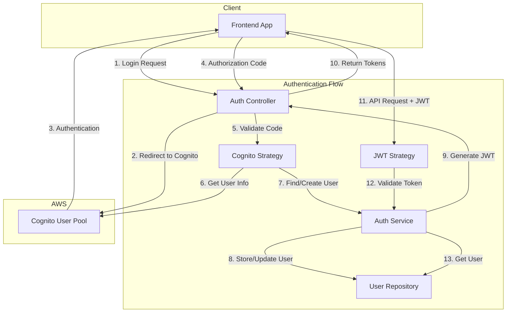

# Authentication Service

## Overview

The Authentication Service handles user authentication and authorization for the Perfect Match application. It integrates with AWS Cognito for secure, scalable identity management while maintaining a local database record of users for application-specific data.

## Architecture



## Key Components

### Backend Components

#### 1. Auth Module
Coordinates all authentication-related functionality, setting up JWT, defining authentication strategies, and connecting services.

#### 2. Auth Controller
Provides API endpoints for:
- Initiating Cognito login
- Handling OAuth2 callbacks
- Refreshing JWT tokens
- User profile retrieval
- Logging out

#### 3. Auth Service
Core service that:
- Manages user creation and retrieval
- Generates and validates JWT tokens
- Integrates with Cognito
- Handles user profile updates

#### 4. Authentication Strategies
- **JWT Strategy**: Validates local JWT tokens for API requests
- **Cognito Strategy**: Implements OAuth2 flow with AWS Cognito

#### 5. User Entity
Database model that stores:
- Basic user information
- Authentication provider data
- Profile completion status
- Subscription tier

### Frontend Components

#### 1. Authentication Context
React context provider that:
- Manages authentication state
- Provides login and logout functions
- Handles token refresh
- Stores and retrieves user information

#### 2. Auth Utilities
Helper functions that:
- Store and retrieve tokens securely
- Parse token expiration
- Handle API authentication requests
- Manage user session data

#### 3. Protected Route Component
Higher-order component that:
- Guards routes requiring authentication
- Redirects unauthenticated users
- Supports profile completion requirements
- Shows loading states during authentication checks

#### 4. Auth UI Components
- Login button component
- OAuth callback handler page
- Authentication-aware views

## Authentication Flow

1. **Login Initiation**:
   - User clicks login button in the frontend
   - Frontend redirects to the `/auth/login` endpoint
   - Backend redirects to AWS Cognito hosted UI

2. **Cognito Authentication**:
   - User enters credentials in Cognito UI
   - Cognito validates credentials
   - Cognito redirects to the callback URL with authorization code

3. **Token Generation**:
   - Backend exchanges authorization code for Cognito tokens
   - Backend retrieves user information from Cognito
   - Backend creates or updates local user record
   - Backend generates JWT tokens for API access

4. **API Authorization**:
   - Frontend includes JWT token in Authorization header
   - JWT strategy validates token
   - If valid, request proceeds with user context

5. **Token Refresh**:
   - When access token expires, frontend uses refresh token
   - Backend validates refresh token and issues new tokens

## Configuration

The authentication service is configured through environment variables:

```
# JWT Configuration
JWT_SECRET=your-secure-secret
JWT_EXPIRES_IN=1h
JWT_REFRESH_EXPIRES_IN=7d

# AWS Cognito Configuration
COGNITO_USER_POOL_ID=us-east-1_xxxxxxxx
COGNITO_APP_CLIENT_ID=xxxxxxxxxxxxxxxx
COGNITO_DOMAIN=your-domain.auth.us-east-1.amazoncognito.com
COGNITO_CALLBACK_URL=http://localhost:3000/api/v1/auth/callback
COGNITO_LOGOUT_URL=http://localhost:3000
```

## Security Considerations

1. **JWT Token Storage**:
   - Access tokens stored in memory (for frontend SPA)
   - Refresh tokens stored in HttpOnly cookies or secure storage

2. **Token Expiration**:
   - Short-lived access tokens (1 hour)
   - Longer-lived refresh tokens (7 days)
   - Automatic token refresh on expiration

3. **Authentication Providers**:
   - Primary: AWS Cognito
   - JWT for API access

4. **Password Security**:
   - Handled by AWS Cognito
   - NIST-compliant password policies
   - MFA capability

## Frontend Integration

The frontend integrates with the authentication service through:

### 1. Authentication Context

```typescript
// Usage example
import { useAuth } from '@/hooks/auth/useAuth';

const MyComponent = () => {
  const { isAuthenticated, isLoading, user, login, logout } = useAuth();
  
  if (isLoading) {
    return <div>Loading...</div>;
  }
  
  return isAuthenticated ? (
    <div>
      <h1>Welcome, {user?.firstName}!</h1>
      <button onClick={logout}>Logout</button>
    </div>
  ) : (
    <button onClick={login}>Login</button>
  );
};
```

### 2. Protected Routes

```typescript
// Usage example
import ProtectedRoute from '@/components/auth/ProtectedRoute';

// In a page component
<ProtectedRoute 
  requiresCompleteProfile={true}
  requiresCompleteQuestionnaire={true}
>
  <Dashboard />
</ProtectedRoute>
```

### 3. Login Flow

- Simple login button triggers Cognito redirect
- Callback page handles the OAuth response
- Tokens stored securely
- Automatic routing based on profile completion state

## Future Enhancements

1. **Social Login Integration**:
   - Configure Cognito for social identity providers (Google, Facebook, etc.)
   - Update local user records with social profile data

2. **Multi-Factor Authentication**:
   - Enable MFA in Cognito user pool
   - Update UI flow to handle MFA challenges

3. **Role-Based Access Control**:
   - Implement roles and permissions
   - Enhance JWT payload with role information
   - Create route guards based on roles

4. **Enhanced Security Measures**:
   - Implement token revocation
   - Add device fingerprinting
   - Suspicious activity detection
