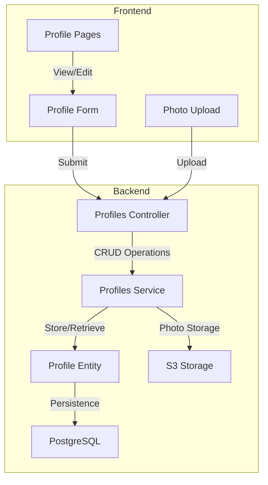

# Profile Management Service

## Overview

The Profile Management Service handles user profile data for the Perfect Match application. It manages the creation, retrieval, updating, and deletion of user profiles, supporting rich profile information including personal details, relationship preferences, attributes, and photos.

## Architecture



## Key Components

### Backend Components

#### 1. Profile Entity
Database model that stores:
- Basic user information (name, birth date, gender, location)
- Relationship preferences (goals, status)
- Biography and interests
- Matching preferences
- Personal attributes
- Profile photos
- Completion status

#### 2. Profiles Service
Core service that:
- Creates and retrieves profiles
- Updates profile information
- Manages profile photos
- Handles profile completion status
- Synchronizes with user record

#### 3. Profiles Controller
REST API endpoints for:
- Creating profiles
- Retrieving profile information
- Updating profiles
- Managing profile photos
- Checking profile completion

### Frontend Components (Planned)

#### 1. Profile Setup Wizard
Multi-step form that:
- Collects basic information
- Gathers relationship preferences
- Uploads profile photos
- Supports partial completion and resumption

#### 2. Profile Management Pages
Interface for:
- Viewing profile information
- Editing profile details
- Managing photos
- Tracking completion progress

## API Endpoints

### Profile Management

```
POST /profiles              # Create new profile
GET /profiles               # List profiles (with pagination/filters)
GET /profiles/me            # Get current user's profile
GET /profiles/:id           # Get specific profile
PATCH /profiles/:id         # Update profile
DELETE /profiles/:id        # Delete profile
```

### Photo Management

```
POST /profiles/:id/photos           # Add photo
DELETE /profiles/:id/photos/:photoUrl  # Remove photo
PATCH /profiles/:id/photos/:photoUrl/main  # Set main photo
```

## Data Model

### Profile Entity

```typescript
export class ProfileEntity {
  id: string;              // UUID primary key
  userId: string;          // Reference to User entity
  
  // Basic Information
  displayName: string;
  birthDate: Date;
  gender: Gender;          // Enum: male, female, non_binary, other, prefer_not_to_say
  location: string;
  occupation: string;
  
  // Relationship preferences
  relationshipGoal: RelationshipGoal;  // Enum: friendship, casual_dating, serious_relationship, etc.
  relationshipStatus: RelationshipStatus;  // Enum: single, divorced, separated, etc.
  
  // Biography and details
  bio: string;
  interests: string;
  
  // Preferences
  preferences: {
    ageMin?: number;
    ageMax?: number;
    distance?: number;
    genders?: Gender[];
    relationshipGoals?: RelationshipGoal[];
  };
  
  // Personal attributes
  attributes: {
    personality?: string[];
    values?: string[];
    lifestyle?: string[];
    communication?: string[];
  };
  
  // Profile pictures
  photos: {
    url: string;
    order: number;
    isMain: boolean;
  }[];
  
  // Status fields
  isActive: boolean;
  isProfileComplete: boolean;
  lastActive: Date;
  createdAt: Date;
  updatedAt: Date;
}
```

## Profile Completion Flow

1. User creates account (via Cognito)
2. Upon first login, user is directed to profile setup
3. User completes profile form sections:
   - Basic information
   - Relationship preferences
   - Bio and interests
   - Photo upload
4. System validates profile completion
5. User's profile status is updated
6. User can now proceed to questionnaire or other features

## Considerations

### Privacy and Security
- Personal data is stored securely in PostgreSQL
- Profile photos are stored in S3 with secure permissions
- Access to profiles is controlled via JWT authentication

### Performance
- Profile retrieval is optimized for matching algorithm
- Photo thumbnails can be generated for faster loading
- Profile data is cached for frequently accessed profiles

### Integration
- Profile completion status is synchronized with User entity
- Profile data informs the matching algorithm
- Location data can be used for proximity-based matching

## Future Enhancements

1. **Social Media Integration**:
   - Import profile data from social accounts
   - Connect profiles to external platforms

2. **Enhanced Profile Features**:
   - Video introductions
   - Voice recordings
   - Verified badges for authentic information

3. **Advanced Profile Analytics**:
   - Profile strength indicators
   - Completion suggestions
   - Profile visibility analytics

4. **Localization**:
   - Multi-language profile support
   - Region-specific profile fields
   - Cultural preference adaptations
