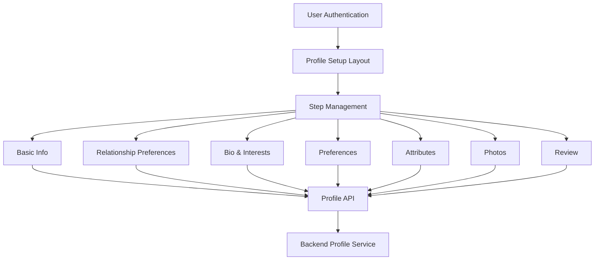

# Profile Setup Wizard

The Profile Setup Wizard is a crucial component of the Perfect Match application, guiding users through creating a comprehensive profile that will be used for compatibility matching. This module provides a structured, step-by-step process for collecting essential information while offering a smooth user experience.

## Architecture



## Key Components

### Frontend Components

#### 1. Profile Setup Context Provider
- Centralizes form state management
- Tracks multi-step wizard progress
- Handles validation and submission
- Manages loading and error states
- Provides form navigation methods

#### 2. Profile Setup Layout
- Common layout wrapper for all steps
- Displays progress indicator via stepper
- Provides consistent navigation controls
- Handles step transitions and validations
- Manages save/submit operations

#### 3. Step Components
Each step is implemented as a self-contained component that:
- Renders the appropriate form fields
- Handles field-level validation
- Updates the context with form data
- Provides a consistent user experience

#### 4. Route Protection
- Ensures users are authenticated
- Redirects to appropriate steps based on completion status
- Handles unauthorized access attempts

### Implementation Structure

```
frontend/
│
├── src/
│   ├── lib/
│   │   └── profile/
│   │       ├── types.ts            # Type definitions and interfaces
│   │       ├── enums.ts            # Enumerations for profile data
│   │       └── profileApi.ts       # API service for profile operations
│   │
│   ├── hooks/
│   │   └── profile/
│   │       └── useProfileSetup.tsx # Context provider and custom hook
│   │
│   ├── components/
│   │   └── profile/
│   │       ├── ProfileSetupLayout.tsx      # Common layout wrapper
│   │       └── steps/                      # Individual step components
│   │           ├── BasicInfoStep.tsx
│   │           ├── RelationshipPreferencesStep.tsx
│   │           ├── BioInterestsStep.tsx
│   │           ├── PreferencesStep.tsx
│   │           ├── AttributesStep.tsx
│   │           ├── PhotosStep.tsx
│   │           └── ReviewStep.tsx
│   │
│   └── pages/
│       └── profile/
│           └── setup/
│               ├── index.tsx        # Entry point, redirects to first step
│               └── [step].tsx       # Dynamic step page component
```

## Implementation Status

All components of the Profile Setup Wizard have been fully implemented:

- **ProfileSetupLayout**: Complete with step navigation, validation indicators, and progress tracking
- **useProfileSetup Hook**: Implemented with comprehensive form state management and validation logic
- **Step Components**: All seven step components are fully implemented:
  - **BasicInfoStep**: Collects name, birth date, gender, location, and occupation
  - **RelationshipPreferencesStep**: Handles relationship goals and status selection
  - **BioInterestsStep**: Provides text areas for personal bio and interests with validation
  - **PreferencesStep**: Manages age range, distance, gender preferences, and relationship goal preferences
  - **AttributesStep**: Implemented multi-select fields for personality traits, values, lifestyle, and communication style
  - **PhotosStep**: Includes photo upload, deletion, and primary photo selection functionality
  - **ReviewStep**: Displays all profile information with edit capabilities and validation status

The implementation includes:
- Full API integration with the backend profile service
- Comprehensive field and form-level validation
- Progress tracking and persistent state management
- Responsive design for all form components
- Error handling and loading states
- Dynamic URL routing for direct step access

## User Flow

1. User authenticates through the Auth System
2. After login, new users are directed to the profile setup wizard
3. Users complete each step in sequence:
   - Basic Information (name, age, gender, location)
   - Relationship Preferences (goals, status)
   - Bio & Interests (free-form text about themselves)
   - Preferences (partner preferences, distance, age range)
   - Attributes (personality traits, values, lifestyle)
   - Photos (profile pictures, including main photo selection)
   - Review (final validation and profile submission)
4. Each step is saved automatically before proceeding
5. Users can return to previous steps to edit information
6. After completion, users proceed to the questionnaire module

## State Management

The profile setup wizard uses React Context for centralized state management:
- Form data for each step is stored in a unified state object
- Step navigation is tracked and controlled centrally
- Validation rules ensure data integrity before proceeding
- API interactions (loading, saving, errors) are managed consistently

## Validation Strategy

- Step-level validation prevents navigation to next step if required fields are missing
- Field-level validation provides immediate feedback on input errors
- Form-level validation ensures data consistency before submission
- Server-side validation provides additional data integrity checks

## Integration Points

- **Authentication System:** The wizard integrates with the app's authentication system to ensure users are logged in and to associate profiles with user accounts.
- **Backend API:** Form data is saved to the backend through RESTful API endpoints.
- **Questionnaire Module:** After profile completion, users are directed to the personality questionnaire.
- **Matching Algorithm:** Profile data feeds into the AI-powered matching algorithm.

## Next Steps

With the Profile Setup Wizard now fully implemented, the development focus shifts to:

1. **Questionnaire Engine Implementation**
   - Creating the adaptive questionnaire flow
   - Implementing the branching logic
   - Designing the UI components for question presentation

2. **AWS Infrastructure Deployment**
   - Deploying the CDK stacks to the development environment
   - Setting up S3 for production-ready photo storage
   - Configuring Cognito user pools

3. **Real Photo Upload Implementation**
   - Replacing the mock implementation with actual S3 integration
   - Adding image optimization and validation
   - Implementing moderation workflows

## Future Enhancements

1. **Profile Completion Incentives**
   - Gamification elements to encourage thorough profile creation
   - Visual progress indicators with rewards

2. **Profile Import Options**
   - Social media profile imports (LinkedIn, Facebook)
   - Previous dating app profile imports

3. **Enhanced Photo Management**
   - AI-assisted photo selection recommendations
   - Photo enhancement and filtering options
   - Multiple photo uploads with drag-and-drop reordering

4. **Accessibility Improvements**
   - Enhanced keyboard navigation
   - Screen reader optimizations
   - Color contrast considerations

5. **Progressive Enhancement**
   - Offline support for partially completing the setup
   - Background saving to prevent data loss
